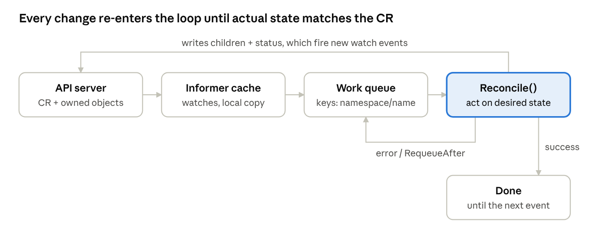

# Operator 101: Building Kubernetes Operators, Starting with nginx and PHP

A six-day, hands-on course that takes you from deploying nginx by hand to writing three small operators of your own. It is written to be easy to follow ("explain it like I'm 10") without dropping any of the real terms, because the goal is to troubleshoot production operators such as the Percona Operators.

Every lab and every line of the reference code was run end to end on a real cluster on 2026-10-04. See [TESTING.md](TESTING.md) for the versions and results.

## Start here

| Day | Lesson | You build |
| --- | --- | --- |
| 1 | [nginx by hand](day-1-nginx-by-hand/README.md) | ConfigMap + Deployment + Service, then break them |
| 2 | [Your first CRD and operator](day-2-first-crd-and-operator/README.md) | The StaticSite CRD by hand, then a Kubebuilder operator |
| 3 | [Status and ownership](day-3-status-and-ownership/README.md) | Status, conditions, events, content-hash rollouts |
| 4 | [PhpApp](day-4-phpapp/README.md) | A two-part app (nginx + php-fpm) with gates and a Secret watch |
| 5 | [Cleanup, tests, shipping](day-5-cleanup-tests-shipping/README.md) | Finalizers, CEL validation, envtest, in-cluster deploy, CRD versions |
| 6 | [Stateful workloads](day-6-stateful-workloads/README.md) | KVCluster (Valkey on a StatefulSet) and KVBackup |

## Repository layout

```text
.
├── README.md                     this page: overview and daily outline
├── day-1-nginx-by-hand/          one folder per day, each with a README lesson
├── ...
├── day-6-stateful-workloads/
├── labs/dayN/                    the YAML files the lessons ask you to write
├── reference/site-operator/      finished Go code for all four kinds + setup.sh
├── images/                       diagrams used in the lessons
└── TESTING.md                    what was tested, on which versions, and what we found
```

## Your playground: kind or k3d

The lessons use [kind](https://kind.sigs.k8s.io/). [k3d](https://k3d.io/) (k3s in Docker) works just as well; the course was tested on k3s. The differences you will meet:

| Task | kind | k3d |
| --- | --- | --- |
| Create a cluster | `kind create cluster --name ops-lab` | `k3d cluster create ops-lab` |
| Load a locally built image | `kind load docker-image site-operator:dev --name ops-lab` | `k3d image import site-operator:dev -c ops-lab` |
| Default StorageClass (Day 6) | `standard` | `local-path` |
| Delete the cluster | `kind delete cluster --name ops-lab` | `k3d cluster delete ops-lab` |

Both default StorageClasses use the local-path provisioner, so neither can resize disks. Day 6 relies on that.

## Course plan

### Overview

Six days of daily training (eight lessons, about 6–7 hours a day) that take you from deploying nginx by hand to writing two small operators of your own: **StaticSite** (nginx serving a page) and **PhpApp** (nginx + php-fpm). Simple apps keep the focus on how operators work rather than on database internals.

Day 6 adds a third operator, **KVCluster**: a small replicated database on a StatefulSet, to learn the stateful patterns every database operator relies on.

**By the end you can:** write a CRD, scaffold and run a controller, explain every step of a reconcile loop, and read any operator's logs and status with that model in mind.

**Prerequisites:** kubectl basics (Pods, Deployments, Services). No Go needed up front; each lesson introduces just enough.

**Lab setup**

- A local cluster: [kind](https://kind.sigs.k8s.io/), [k3d](https://k3d.io/) or minikube
- kubectl, Go (the version your Kubebuilder release asks for; tested with Go 1.26), Docker or Podman
- [Kubebuilder](https://book.kubebuilder.io/quick-start) (Operator SDK works too; same project layout)
- An editor with Go support (VS Code + Go extension, or GoLand)

### Day 1 — Deploy nginx by hand

Before automating anything, do the job manually so you know exactly what the operator will have to do.

Full lesson: [Day 1 — nginx by hand](day-1-nginx-by-hand/README.md)

**Concepts**

- Desired state (`spec`) vs observed state (`status`)
- Built-in controllers: a Deployment controller creates ReplicaSets, which create Pods
- Labels and selectors tie Services to Pods

**Lab**

1. Create a ConfigMap holding an `index.html`.
2. Create an nginx Deployment (2 replicas) that mounts the ConfigMap at `/usr/share/nginx/html`.
3. Expose it with a Service and test with `kubectl port-forward svc/<name> 8080:80`.
4. Delete a Pod and watch `kubectl get pods -w` — the Deployment controller replaces it.
5. Edit the ConfigMap and time how long the page takes to change (mounted files update after a short delay; env vars never do).

**Write down:** every object you created and every manual step. That list is your operator's job description.

### Day 2 (morning) — Your first CRD: StaticSite

A CustomResourceDefinition adds a new type to the Kubernetes API. On its own it does nothing; it only stores objects until a controller acts on them.

Full lesson (morning and afternoon): [Day 2 — first CRD and operator](day-2-first-crd-and-operator/README.md)

**Concepts**

- CRD anatomy: group, version, kind, plural, scope
- OpenAPI schema validation, defaults, `required` fields
- The `status` subresource
- `additionalPrinterColumns` (what `kubectl get` shows)

**Lab**

1. Write a `StaticSite` CRD by hand with `spec.replicas`, `spec.image` (default `nginx:stable`) and `spec.content` (the HTML).
2. Apply it, then create a `StaticSite` object. Confirm with `kubectl get staticsites` — and notice no Pods appear.
3. Try an invalid object (e.g. `replicas: "two"`) and read the rejection.
4. Run `kubectl explain staticsite.spec` to see your schema served by the API.

**Takeaway:** a CR is just data in etcd. The operator is the program that turns that data into running workloads.

### Day 2 (afternoon) — Scaffold the operator; first reconcile

The operator's core is one function, `Reconcile`, called whenever the StaticSite or anything it owns changes. It compares what the CR asks for with what exists and fixes the difference.



The operator's own writes trigger new events, so a healthy operator runs a few times and then goes quiet.

**Steps**

1. `kubebuilder init --domain example.com --repo example.com/site-operator`
2. `kubebuilder create api --group web --version v1alpha1 --kind StaticSite`
3. Fill in `StaticSiteSpec` (replicas, image, content) in `api/v1alpha1/staticsite_types.go`, then `make manifests generate`. Compare the generated CRD with the one you wrote this morning.
4. In `internal/controller/staticsite_controller.go`:
   1. Fetch the StaticSite; if it's gone, return with no error.
   2. Build the ConfigMap, Deployment and Service in code.
   3. Create each one if missing, update it if it differs (`controllerutil.CreateOrUpdate`).
5. `make install` (CRD into the cluster), then `make run` (controller runs on your laptop against kind).
6. Apply a StaticSite and watch the Deployment, Service and Pods appear.

**Check yourself:** add a log line at the start and end of `Reconcile`. How many times does it run when you create one StaticSite, and why?

### Day 3 — Status, ownership and config changes

A useful operator reports what it sees, cleans up after itself and reacts to every change in the CR.

Full lesson: [Day 3 — status and ownership](day-3-status-and-ownership/README.md)

**Concepts**

- Owner references (`SetControllerReference`) and garbage collection
- `Owns(&appsv1.Deployment{})` so changes to children re-trigger Reconcile
- Status: `readyReplicas`, a `state` field and standard `conditions` (`Ready`, `Progressing`)
- `observedGeneration` to show whether the latest spec has been processed
- Rolling restarts on config change via a content hash annotation on the Pod template

**Lab**

1. Set owner references on the ConfigMap, Deployment and Service. Delete the StaticSite and confirm the children go too.
2. Write `status.readyReplicas` and a `Ready` condition; add `Ready` as a printer column.
3. Delete the Deployment by hand and confirm the operator recreates it.
4. Change `spec.content` and make the Pods roll by putting a hash of the content in a Pod annotation.
5. Set `spec.image` to a tag that doesn't exist. What does `status` show? What do the operator logs show?

**Check yourself:** `kubectl get staticsite` should tell you if the site is healthy without looking at Pods.

### Day 4 — PhpApp: two components that depend on each other

Real operators manage several parts that must be configured to talk to each other. PhpApp runs nginx in front of php-fpm, which is the same pattern as a database plus its proxy or sidecar.

Full lesson: [Day 4 — PhpApp](day-4-phpapp/README.md)

**Design the CR**

- `spec.code`: a small `index.php`
- `spec.secretName`: a Secret whose keys become env vars for PHP
- `spec.php` and `spec.nginx`: image (defaulted in code) and replicas
- `status.state`: `initializing` → `ready`, or `error`, plus a condition per component

**Lab**

1. `kubebuilder create api --group web --version v1alpha1 --kind PhpApp`
2. Reconcile in order: Secret check → php-fpm Deployment + Service → nginx ConfigMap (`fastcgi_pass` to the php Service) → nginx Deployment + Service.
3. Only mark `ready` when both Deployments are fully rolled out. Never loop or sleep while waiting: return, and let the next event (a Pod becoming ready) start a fresh pass.
4. Make the PHP page print an env var from the referenced Secret. Watch the Secret (`Watches` + a map function) so changing it rolls the PHP Pods.
5. Break it on purpose: reference a missing Secret. The CR should say why it's stuck, in `status` and as an Event.

**Check yourself:** from `kubectl describe phpapp` alone, can you tell which component is unhealthy and why?

### Day 5 (morning) — Finalizers, validation and webhooks

Finalizers let an operator run cleanup before a CR disappears. They are also the most common reason an object hangs in `Terminating`.

Full lesson (morning and afternoon): [Day 5 — cleanup, tests, shipping](day-5-cleanup-tests-shipping/README.md)

**Concepts**

- Finalizers: add on create, do cleanup when `deletionTimestamp` is set, then remove the finalizer
- Validation with kubebuilder markers (`+kubebuilder:validation:Minimum=1`, enums, defaults) and CEL rules
- Defaulting and validating admission webhooks, and the cert-manager setup they need

**Lab**

1. Add a finalizer to PhpApp that removes its entry from a "shop directory" ConfigMap in another namespace before the PhpApp goes.
2. Stop the operator (`Ctrl+C` on `make run`), delete a PhpApp, and see it hang with `deletionTimestamp` set. Restart the operator and watch it finish.
3. Add CEL rules: no `:latest` images, code must contain `<?php`, `secretName` can't change. Regenerate and test bad CRs.
4. Optional: scaffold a defaulting and validating webhook, and learn how webhooks fail.

**Takeaway:** an object stuck in `Terminating` means some controller hasn't removed its finalizer. Find out which one, and why it can't, before removing it by hand.

### Day 5 (afternoon) — Testing, packaging and versioning

This lesson takes the operator from "runs on my laptop" to something you could install and upgrade on any cluster.

**Concepts**

- envtest: runs a real API server and etcd for controller tests (no kubelet, so Pods never start)
- Running in-cluster: image build, Deployment, ServiceAccount and the RBAC generated from `+kubebuilder:rbac` markers
- Leader election when you run more than one replica
- Packaging: kustomize (`config/`), Helm, OLM bundles
- CRD versions: adding `v1beta1`, choosing the storage version, conversion

**Lab**

1. Write an envtest test: create a PhpApp and assert that both Deployments exist with the right owner reference.
2. Build the image, load it into the cluster (`kind load` or `k3d image import`), `make deploy`, then read the operator's logs with `kubectl logs -n <ns> deploy/<name>`.
3. Remove one RBAC marker, redeploy, and find the "forbidden" error in the logs.
4. Add a `v1beta1` PhpApp (same shape) as the new storage version; check old CRs still work and read `status.storedVersions`. Learn why a renamed field would need a conversion webhook.

**Check yourself:** list what must be upgraded, and in what order, when a new operator release changes the CRD.

### Day 6 — Stateful workloads

Databases need stable names, their own disks, and careful updates. Build KVCluster, an operator for a small replicated key-value database.

Full lesson: [Day 6 — stateful workloads](day-6-stateful-workloads/README.md)

**Concepts**

- StatefulSets: stable Pod names, ordered start and update, headless Services
- PersistentVolumeClaims and StorageClasses; what happens to data when Pods or the whole cluster object go away
- Primary and replicas; why failover is the operator's (or a helper's) job, not the StatefulSet's
- Backups as their own custom resource that runs a Job

**Lab:** run Valkey on a StatefulSet by hand, then build the KVCluster operator with a KVBackup resource, and break storage, replication and DNS on purpose.

### Wrap-up

**Progress checklist**

- [ ] Day 1 — nginx deployed by hand; manual steps listed
- [ ] Day 2 — StaticSite CRD written and validated
- [ ] Day 2 — StaticSite operator creates nginx Deployment + Service
- [ ] Day 3 — Status, owner references, self-healing, config rollouts
- [ ] Day 4 — PhpApp operator with nginx + php-fpm
- [ ] Day 5 — Finalizer and validation added
- [ ] Day 5 — Tested, deployed in-cluster, CRD version added
- [ ] Day 6 — KVCluster on a StatefulSet, with backups

**What comes next:** with these operators built, and Day 6's stateful patterns in hand, a follow-up plan can move to reading the Percona Operators' source with the same model.

**Resources**

- [The Kubebuilder Book](https://book.kubebuilder.io/) — the CronJob tutorial pairs well with Days 2–3
- [Operator SDK Go tutorial](https://sdk.operatorframework.io/docs/building-operators/golang/tutorial/)
- [Kubernetes docs: Operator pattern](https://kubernetes.io/docs/concepts/extend-kubernetes/operator/)
- [Kubernetes docs: Custom Resources](https://kubernetes.io/docs/concepts/extend-kubernetes/api-extension/custom-resources/)
- [controller-runtime](https://github.com/kubernetes-sigs/controller-runtime)
- [A Tour of Go](https://go.dev/tour/) — enough Go for these lessons

## License

This repository is licensed under the [GNU GPL v3](LICENSE). The Go files in `reference/site-operator` still carry the default Apache 2.0 header that Kubebuilder adds to every scaffolded file; change or remove it if you want the headers to match.
