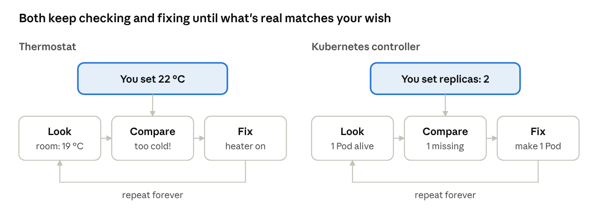
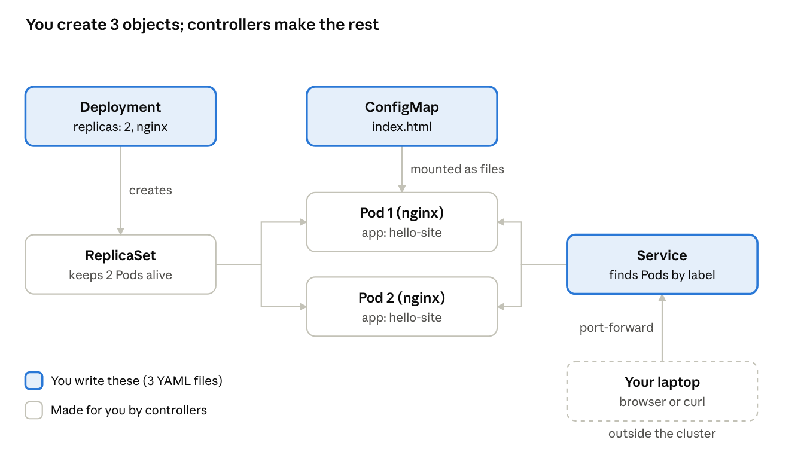

# Day 1 — Deploy nginx by hand

[← Course overview](../README.md) · [Day 2 →](../day-2-first-crd-and-operator/README.md)

> **Lab files:** every YAML file in this lesson is ready-made in [`labs/day1/`](../labs/day1/): [`configmap.yaml`](../labs/day1/configmap.yaml), [`deployment.yaml`](../labs/day1/deployment.yaml), [`service.yaml`](../labs/day1/service.yaml). Type them yourself the first time; use these to check your work.

Today you do by hand every job an operator will later do for you: run a small website (nginx) on Kubernetes, make it reachable, and watch Kubernetes fix it when things break. If you know what the manual work feels like, the operator code on Day 2 will make sense line by line.

## Today's plan

About 6 hours, with a break whenever you finish a Part.

| Time | What you do |
| --- | --- |
| 0:30 | The big idea + meet the pieces |
| 0:30 | Part 1 — set up your playground |
| 1:00 | Parts 2–3 — note card and recipe card |
| 0:30 | Part 4 — phone number, visit your site |
| 1:00 | Part 5 — watch Kubernetes heal itself |
| 1:30 | Part 6 — change and break things, troubleshooting corner |
| 0:30 | Job description + check yourself |

## The big idea: Kubernetes keeps promises

Think of the thermostat at home. You don't turn the heater on and off yourself. You say "I want 22 °C" and walk away. The thermostat keeps checking the room: too cold, heater on; warm enough, heater off. It never stops checking.

Kubernetes works the same way. You don't say "start a web server." You write down what you want to be true, like "2 copies of nginx should always be running." Kubernetes keeps checking and fixing until that's true, and keeps it true.



The real words for this:

- **Desired state** — what you asked for. In Kubernetes files it lives under `spec:`.
- **Actual state** — what's really happening. Kubernetes reports it under `status:`.
- **Controller** — a small program that runs the check-and-fix loop for one kind of thing. Kubernetes already ships with many of them, such as the Deployment controller you'll use today.
- **Operator** — a controller *you* write for your own kind of thing. That's where this week ends up.

This way of working is called **declarative**: you declare *what* you want, not *how* to do it, step by step.

## Meet the pieces

Picture Kubernetes as a school cafeteria that serves lunches. Here is who's who, with the real meaning next to each picture.

| Piece | Picture it as | What it really is |
| --- | --- | --- |
| Cluster | The whole cafeteria | A group of computers Kubernetes manages as one |
| Node | One kitchen counter | One computer (or VM) in the cluster that runs your apps |
| Container | A sealed food pack | Your app plus everything it needs, built from an *image* like `nginx:stable` |
| Pod | A lunchbox | The smallest thing Kubernetes runs: one or more containers sharing a network address and storage |
| Deployment | A recipe card: "always have 2 of these lunchboxes" | Your desired state for a stateless app: which image, how many copies, how to update them |
| ReplicaSet | The helper who counts lunchboxes | Keeps exactly N identical Pods running; the Deployment creates and manages it for you |
| Service | The cafeteria's phone number | A stable name and address that sends traffic to whichever matching Pods are alive right now |
| ConfigMap | A note card tucked in the lunchbox | Settings or small files stored in Kubernetes and handed to Pods |
| Label | A name sticker | A `key: value` tag (like `app: hello-site`) that other objects use to find things |
| API server | The front desk | The only door into Kubernetes; everything you ask for goes through it and is saved in its database (etcd) |
| kubectl | Your walkie-talkie to the front desk | The command-line tool that talks to the API server |

Here's what you'll build today:



One thing to notice: you will only create **three** objects (ConfigMap, Deployment, Service). The ReplicaSet and Pods are made *for* you by controllers. That's the same trick an operator plays.

## Part 1 — Set up your playground

[kind](https://kind.sigs.k8s.io/) ("Kubernetes in Docker") builds a whole practice cluster inside Docker on your laptop. It's a sandbox: break anything you like, then throw it away.

1. Install Docker (or Podman), [kubectl](https://kubernetes.io/docs/tasks/tools/) and [kind](https://kind.sigs.k8s.io/docs/user/quick-start/#installation). On a Mac: `brew install kubectl kind`.
2. Create the cluster:

```bash
kind create cluster --name ops-lab
```

3. Check that kubectl is talking to it:

```bash
kubectl cluster-info --context kind-ops-lab
kubectl get nodes
```

You should see one node named `ops-lab-control-plane` with status `Ready`. That one "kitchen counter" is enough for today.

4. Peek at the controllers Kubernetes already runs for you:

```bash
kubectl get pods -n kube-system
```

The Pod named `kube-controller-manager-...` holds the built-in controllers, including the Deployment and ReplicaSet controllers you'll rely on today.

**Tip:** open two terminal windows side by side. Use one to make changes and the other to *watch* what happens.

## Part 2 — The note card (ConfigMap)

nginx needs a web page to show. We'll keep the page in a ConfigMap, a note card stored inside Kubernetes, so we can change it without building a new image.

Every Kubernetes object you write has the same four top-level parts. Learn them once and every YAML file gets easier:

- `apiVersion` — which version of the rulebook this object follows
- `kind` — what type of thing it is
- `metadata` — its name, labels and other name-tag info
- `spec` or `data` — the actual content (what you want)

Save this as `configmap.yaml`:

```yaml
apiVersion: v1            # core API group, version 1
kind: ConfigMap           # a note card of settings or files
metadata:
  name: hello-site        # the note card's name
data:
  index.html: |           # a key that will become a file name
    <h1>Hello from Kubernetes!</h1>
    <p>Version 1</p>
```

The `|` means "keep the next lines exactly as written, line breaks and all."

Apply it and look at it:

```bash
kubectl apply -f configmap.yaml
kubectl get configmap hello-site -o yaml
```

`kubectl apply` sends your file to the API server, the front desk. The front desk checks it, saves it, and replies `configmap/hello-site created`. Nothing is running yet. A ConfigMap is only data waiting for someone to use it.

## Part 3 — The recipe card (Deployment)

The Deployment is the promise: "always keep 2 nginx lunchboxes running, each with the note card inside." Save this as `deployment.yaml`:

```yaml
apiVersion: apps/v1               # Deployments live in the "apps" API group
kind: Deployment
metadata:
  name: hello-site
  labels:
    app: hello-site               # a sticker on the Deployment itself
spec:
  replicas: 2                     # THE PROMISE: 2 copies, always
  selector:
    matchLabels:
      app: hello-site             # "the Pods I own wear this sticker"
  template:                       # the cookie cutter for each Pod
    metadata:
      labels:
        app: hello-site           # every new Pod gets this sticker
    spec:
      containers:
      - name: nginx
        image: nginx:stable       # the sealed food pack to run
        ports:
        - containerPort: 80       # nginx listens here
        volumeMounts:
        - name: html
          mountPath: /usr/share/nginx/html   # where nginx looks for pages
      volumes:
      - name: html
        configMap:
          name: hello-site        # put the note card's files here
```

The most important pair is `selector` and the template's `labels`. The Deployment finds "its" Pods only by their stickers. If the two don't match, the API server rejects the Deployment.

In your second terminal, start watching:

```bash
kubectl get deployment,replicaset,pods -l app=hello-site -w
```

Then apply in the first terminal:

```bash
kubectl apply -f deployment.yaml
```

Watch the chain reaction: the Deployment appears, then a ReplicaSet (named `hello-site-<random>`), then two Pods going `ContainerCreating` → `Running`. You asked for one thing; controllers built the rest.

Check that the note card landed inside a Pod:

```bash
kubectl exec deploy/hello-site -- cat /usr/share/nginx/html/index.html
```

## Part 4 — The phone number (Service) and visiting your site

Pods come and go, and each new Pod gets a new IP address. Calling a Pod directly is like calling a friend's old phone after they changed numbers. A Service is one number that always rings whichever matching Pods are alive. Save this as `service.yaml`:

```yaml
apiVersion: v1
kind: Service
metadata:
  name: hello-site
spec:
  selector:
    app: hello-site      # ring any Pod wearing this sticker
  ports:
  - port: 80             # the number callers dial
    targetPort: 80       # the port on the Pod that answers
```

```bash
kubectl apply -f service.yaml
kubectl get service hello-site
kubectl get endpointslices -l kubernetes.io/service-name=hello-site
```

The EndpointSlice is the Service's contact list: the Pod IPs it's sending traffic to right now. You should see two addresses, one per Pod. **An empty contact list is the #1 reason a Service "doesn't work".** It almost always means the selector doesn't match the Pods' labels, or no Pods are Ready.

Now visit your site. Your laptop isn't inside the cluster, so open a tunnel:

```bash
kubectl port-forward svc/hello-site 8080:80
```

Open http://localhost:8080 in a browser (or run `curl localhost:8080` in another terminal). You should see **Hello from Kubernetes! Version 1**. Press `Ctrl+C` to close the tunnel when you're done.

Good to know: `port-forward` picks one Pod behind the Service and sticks to it. Real users reach a Service through a LoadBalancer or an Ingress instead, but the tunnel is perfect for testing.

## Part 5 — Watch Kubernetes heal itself

This is the moment the big idea becomes real. Keep the watch running in your second terminal:

```bash
kubectl get pods -l app=hello-site -w
```

**Experiment 1: take a lunchbox away.** In the first terminal, delete one Pod (copy a real name from `kubectl get pods`):

```bash
kubectl delete pod hello-site-<rest-of-name>
```

Within a second or two a brand-new Pod with a different name appears. The ReplicaSet controller counted 1, wanted 2, and made one. Nobody told it to; that's its loop.

If your Part 4 `port-forward` is still running, it may have just stopped with an error. The tunnel is pinned to one Pod, and if that's the Pod you deleted, the tunnel dies with it. Start it again whenever that happens today.

**Experiment 2: who owns whom?** Every Pod carries a note saying who created it:

```bash
kubectl get pod <pod-name> -o jsonpath='{.metadata.ownerReferences[0].kind}{" "}{.metadata.ownerReferences[0].name}{"\n"}'
kubectl get rs -l app=hello-site -o jsonpath='{.items[0].metadata.ownerReferences[0].kind}{"\n"}'
```

The Pod is owned by a ReplicaSet; the ReplicaSet is owned by the Deployment. These **owner references** do two jobs. When you delete the parent, Kubernetes cleans up the children (that's called *garbage collection*). And when a child changes, the parent's controller hears about it. Your operator will set owner references the same way on Day 2.

**Experiment 3: spec vs status.** Look at the full Deployment:

```bash
kubectl get deployment hello-site -o yaml
```

Find these fields and say what each one means out loud:

| Field | Where | Meaning |
| --- | --- | --- |
| `spec.replicas` | spec (your wish) | How many Pods you asked for |
| `status.replicas` / `status.readyReplicas` | status (the report) | How many exist / how many are ready to serve |
| `metadata.generation` | metadata | Goes up by 1 every time you change the spec |
| `status.observedGeneration` | status | The latest generation the controller has acted on. If it's lower than `generation`, the controller hasn't caught up yet |
| `status.conditions` | status | Short yes/no reports such as `Available` and `Progressing`, each with a reason and message |

You write `spec`; controllers write `status`. Remember this split. Reading `status` is the first thing you'll do when any operator misbehaves.

**Experiment 4: read the controller's diary.**

```bash
kubectl describe deployment hello-site
kubectl get events --sort-by=.lastTimestamp
```

Events are short notes controllers leave as they work, like "Scaled up replica set hello-site-xxxx to 2." They expire after about an hour, so check them early when troubleshooting.

## Part 6 — Change things, then break things

Support work is mostly "something changed and now it's weird." Practise both on purpose.

### A. Change the web page

In `configmap.yaml`, change `Version 1` to `Version 2` and apply it. Keep `port-forward` running and poll the page:

```bash
kubectl apply -f configmap.yaml
while true; do curl -s localhost:8080 | grep Version; sleep 5; done
```

The page changes by itself, but not instantly: in our test run it took 40–70 seconds, so allow about a minute. The kubelet (the agent on each node) refreshes mounted ConfigMap files on its own schedule. Two traps to remember: files mounted with `subPath`, and ConfigMap values passed as environment variables, **never** update until the Pod restarts. And nginx re-reads web pages from disk, but not its own config file. That's why operators often force a restart when config changes (you'll build that on Day 3).

### B. Scale by hand, and meet drift

```bash
kubectl scale deployment hello-site --replicas=4
kubectl get pods -l app=hello-site
```

Now 4 Pods run, but `deployment.yaml` still says 2. Run `kubectl apply -f deployment.yaml` and you're back to 2. The cluster and your file disagreed for a while. This is called **drift**. Remember it: an operator treats its custom resource as the single source of truth and will undo hand edits to the things it manages.

### C. A safe upgrade (rolling update)

```bash
kubectl set image deployment/hello-site nginx=nginx:alpine
kubectl rollout status deployment/hello-site
kubectl get rs -l app=hello-site
```

You'll now see two ReplicaSets: the new one scaled up and the old one scaled to 0. The Deployment swapped lunchboxes a few at a time, so the site never went down. The old ReplicaSet is kept so you can roll back.

### D. A bad upgrade

```bash
kubectl set image deployment/hello-site nginx=nginx:does-not-exist
kubectl get pods -l app=hello-site
```

One new Pod gets stuck in `ErrImagePull` / `ImagePullBackOff`. Your site **still works**, because the Deployment won't remove old Pods until new ones are Ready. Investigate like a detective:

```bash
kubectl describe pod <stuck-pod-name>        # read the Events at the bottom
kubectl rollout status deployment/hello-site # waits, never finishes
```

After about 10 minutes (`progressDeadlineSeconds`, default 600) the Deployment's `Progressing` condition turns `False` with reason `ProgressDeadlineExceeded`. Fix it:

```bash
kubectl rollout undo deployment/hello-site
```

### E. A broken phone number

Edit `service.yaml` so the selector says `app: hello-sight` (a typo), apply it, and check the contact list:

```bash
kubectl apply -f service.yaml
kubectl get endpointslices -l kubernetes.io/service-name=hello-site
```

No addresses: the `ENDPOINTS` column shows `<unset>`. The Pods are perfectly healthy, but nobody can reach them through the Service. A new `kubectl port-forward svc/hello-site 8080:80` doesn't even give a clear error; it just hangs, because there's no Pod behind the Service to pick. Fix the typo, apply again, and the addresses come back.

## Troubleshooting corner

When something's wrong, follow the chain from the top: what you asked for (spec) → what the controller reports (status, events) → the children it made → the Pods → the container logs.

| What you see | Where to look | Usual cause |
| --- | --- | --- |
| Pod `Pending` | `kubectl describe pod` → Events | Not enough CPU/memory on any node, or a volume it needs isn't available |
| `ErrImagePull` / `ImagePullBackOff` | `kubectl describe pod` → Events | Image name or tag is wrong, or the registry needs credentials |
| `CrashLoopBackOff` | `kubectl logs <pod> --previous` | The app starts and then exits, often from bad config |
| `ContainerCreating` for a long time | `kubectl describe pod` | A ConfigMap or Secret it mounts doesn't exist |
| Service reaches nothing | `kubectl get endpointslices -l kubernetes.io/service-name=<svc>` | Selector doesn't match Pod labels, or no Pods are Ready |
| Rollout never finishes | `kubectl rollout status`, Deployment `status.conditions` | New Pods never become Ready (bad image, failing probe) |
| Your change "didn't happen" | `metadata.generation` vs `status.observedGeneration` | The controller hasn't processed it yet, or something re-applied the old file (drift) |

**Try it:** create a Deployment that mounts a ConfigMap named `does-not-exist`, then find the cause using only `describe` and events.

## Your operator's job description

Everything you did by hand today is a job the StaticSite operator will take over. Instead of three YAML files, a user will write one short StaticSite and the operator will do the rest.

| What you did by hand today | What the operator will do (and when) |
| --- | --- |
| Wrote `configmap.yaml` with the page | Build the ConfigMap from `spec.content` (Day 2) |
| Wrote `deployment.yaml` with image and replicas | Build the Deployment from `spec.image` and `spec.replicas` (Day 2) |
| Wrote `service.yaml` and matched the labels | Build the Service with labels it controls, so they can't mismatch (Day 2) |
| Ran `kubectl apply` again after every change | Re-check on every change, forever (the reconcile loop, Day 2) |
| Checked owner references | Set itself as owner of every child, so deleting the StaticSite cleans up (Day 3) |
| Read `status` and events to see if it worked | Write its own `status` and events for the StaticSite (Day 3) |
| Waited (or restarted) for the new page to show | Roll the Pods automatically when content changes (Day 3) |
| Fixed drift by re-applying the file | Undo hand edits to its children automatically (Day 2) |

Keep this table handy. On Day 2 you'll write code for each row.

## Check yourself

Try to answer before reading the answers underneath.

1. You created 3 objects. Which other objects appeared, and who made them?
2. You delete a Pod. Which controller notices, and how does it know the Pod was "its" Pod?
3. Where would you look to see whether a controller has acted on your latest change?
4. A Service has no endpoints but the Pods are Running. Name two likely causes.
5. Why did the bad image upgrade not take the site down?
6. Why would an operator undo a `kubectl scale` you ran by hand?

**Answers**

1. A ReplicaSet (made by the Deployment controller) and 2 Pods (made by the ReplicaSet controller). Plus an EndpointSlice, made by the EndpointSlice controller for the Service.
2. The ReplicaSet controller. The Pod has the ReplicaSet's labels and an owner reference pointing to it.
3. Compare `metadata.generation` with `status.observedGeneration`, then read `status.conditions` and events.
4. The selector doesn't match the Pods' labels, or the Pods aren't Ready (for example, a failing readiness probe).
5. A rolling update removes old Pods only after new ones are Ready. The new Pod never became Ready, so the old ones stayed.
6. The custom resource is the source of truth. The operator keeps making reality match it, the same way `kubectl apply` put your Deployment back to 2.

## Clean-up

Keep the kind cluster for Day 2, but remove today's objects:

```bash
kubectl delete -f service.yaml -f deployment.yaml -f configmap.yaml
kubectl get all -l app=hello-site   # should show nothing
```

Notice you never deleted the ReplicaSet or Pods yourself. Owner references made Kubernetes clean them up when the Deployment went away.

---

[← Course overview](../README.md) · [Day 2 →](../day-2-first-crd-and-operator/README.md)
