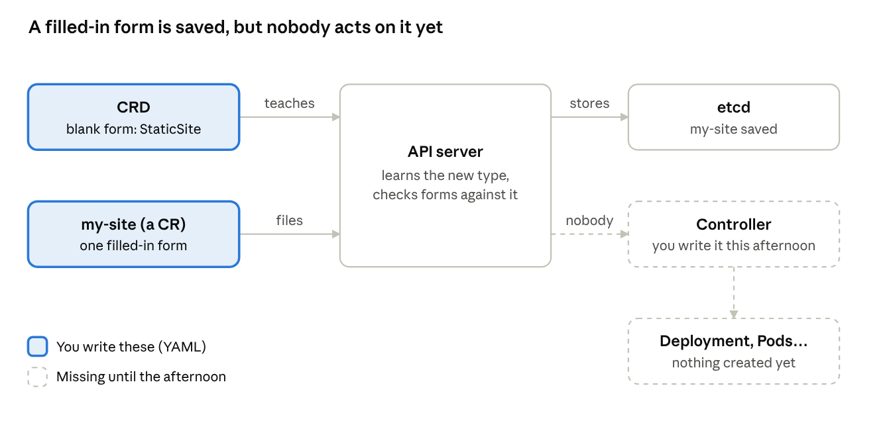
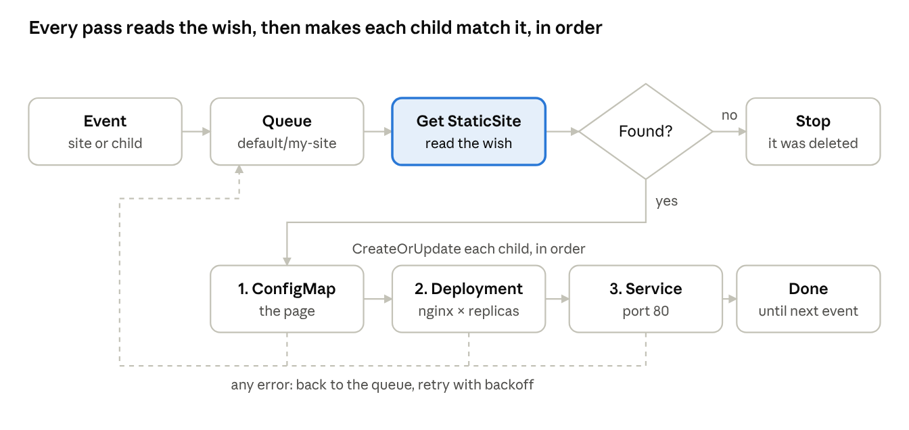

# Day 2 — Your first CRD and your first operator

[← Day 1](../day-1-nginx-by-hand/README.md) · [Day 3 →](../day-3-status-and-ownership/README.md)

> **Lab files:** every YAML file in this lesson is ready-made in [`labs/day2/`](../labs/day2/): [`staticsite-crd.yaml`](../labs/day2/staticsite-crd.yaml), [`my-site.yaml`](../labs/day2/my-site.yaml). Type them yourself the first time; use these to check your work.

> **Finished code:** the operator as it stands at the end of the week is in [`reference/site-operator`](../reference/site-operator/). Peek when you are stuck, not before.

This morning you teach Kubernetes a brand-new word, **StaticSite**. This afternoon you write the program that knows what to do when it hears that word. By the end of the day, one short StaticSite file will build everything you wrote by hand on Day 1.

## Today's plan

About 6½ hours. Keep yesterday's kind cluster (`ops-lab`) running.

| Time | What you do |
| --- | --- |
| **Morning** |  |
| 0:20 | Big idea: teaching Kubernetes a new word |
| 0:40 | Part 1 — write the StaticSite CRD by hand |
| 0:30 | Part 2 — create a StaticSite (and watch nothing happen) |
| 0:45 | Part 3 — test the rules |
| **Afternoon** |  |
| 0:20 | Big idea: meet Kubebuilder |
| 0:30 | Part 4 — scaffold the project |
| 0:45 | Part 5 — describe the wish in Go |
| 1:15 | Part 6 — write Reconcile |
| 0:45 | Part 7 — run it and play |
| 0:20 | Troubleshooting corner + check yourself |

**Before you start the afternoon:** install [Go](https://go.dev/doc/install) (the version Kubebuilder's docs list as supported) and [Kubebuilder](https://book.kubebuilder.io/quick-start#installation). Check with `go version` and `kubebuilder version`.

## Morning big idea: teaching Kubernetes a new word

On Day 1 the front desk (the API server) already knew words like *Pod*, *Deployment* and *Service*. Today you'll add a word it has never heard: *StaticSite*.

Think of the front desk's filing cabinet. It has a blank form for each kind of thing it accepts. A **CustomResourceDefinition (CRD)** is a new blank form you hand the front desk: "From now on, accept StaticSite forms, and here are the boxes on the form and the rules for filling them in." A **custom resource (CR)** is one filled-in form, like "a StaticSite called `my-site` with 2 copies and this web page."



Here's the surprise you'll see this morning: filling in a form doesn't make anything happen. The front desk checks the form, files it, and that's all. Nobody in the building knows what a StaticSite *means* yet. This afternoon you'll write that somebody: the **controller**, which reads StaticSite forms and builds the real things. A CRD plus its controller is what people call an **operator**.

| Word | Picture it as | What it really is |
| --- | --- | --- |
| CRD | A new blank form for the filing cabinet | An object of kind `CustomResourceDefinition` that adds a new type (with its schema) to the API server |
| CR | One filled-in form | An object of your new kind, such as `kind: StaticSite`, stored in etcd like any other object |
| Schema | The boxes on the form and their rules | An OpenAPI v3 description of the fields: their types, limits and defaults |
| Controller | The worker who reads the forms and does the job | A program that watches CRs and creates or changes other objects to match them |

## Part 1 — Write the StaticSite CRD by hand

You'll write the blank form yourself once, so that the file Kubebuilder generates this afternoon won't look like magic. Think about what a StaticSite user should have to say. Only three things: the web page, how many copies, and (optionally) which nginx image.

Save this as `staticsite-crd.yaml`:

```yaml
apiVersion: apiextensions.k8s.io/v1
kind: CustomResourceDefinition
metadata:
  name: staticsites.web.example.com    # MUST be <plural>.<group>
spec:
  group: web.example.com               # your API group (like "apps" for Deployments)
  scope: Namespaced                    # each StaticSite lives in a namespace
  names:
    kind: StaticSite                   # what you write in "kind:"
    plural: staticsites                # used in URLs and "kubectl get staticsites"
    singular: staticsite
    shortNames: [site]                 # lets you type "kubectl get site"
  versions:
  - name: v1alpha1                     # alpha = "still changing, be gentle"
    served: true                       # the API answers on this version
    storage: true                      # objects are saved in etcd in this version
    subresources:
      status: {}                       # spec and status are written separately
    additionalPrinterColumns:          # columns for "kubectl get site"
    - name: Replicas
      type: integer
      jsonPath: .spec.replicas
    - name: Ready
      type: integer
      jsonPath: .status.readyReplicas
    - name: Age
      type: date
      jsonPath: .metadata.creationTimestamp
    schema:
      openAPIV3Schema:                 # the boxes on the form and their rules
        type: object
        properties:
          spec:
            type: object
            required: [content]        # you MUST give a page
            properties:
              content:
                type: string
                minLength: 1
              replicas:
                type: integer
                minimum: 1
                maximum: 10
                default: 1             # filled in if you leave it out
              image:
                type: string
                default: nginx:stable
          status:
            type: object
            properties:
              readyReplicas:
                type: integer
```

Three lines deserve a second look:

- **`metadata.name`** must be exactly `<plural>.<group>`. Get it wrong and the API server refuses the CRD.
- **`storage: true`** marks the one version that's actually saved to disk. Later you can add `v1beta1` while still serving `v1alpha1`. Only one version may be the storage version.
- **`subresources.status`** splits the object into two doors: users write `spec`, controllers write `status`. A normal update can't change `status`, and a status update can't change `spec`.

Apply it and confirm the API server learned the new word:

```bash
kubectl apply -f staticsite-crd.yaml
kubectl get crd staticsites.web.example.com
kubectl api-resources --api-group=web.example.com
```

The last command should list `staticsites` with short name `site` and kind `StaticSite`. The API server is now serving brand-new URLs like `/apis/web.example.com/v1alpha1/namespaces/default/staticsites`, without restarting anything.

## Part 2 — Create your first StaticSite (and watch nothing happen)

Fill in your first form. Save as `my-site.yaml`:

```yaml
apiVersion: web.example.com/v1alpha1   # <group>/<version> from the CRD
kind: StaticSite
metadata:
  name: my-site
spec:
  replicas: 2
  content: |
    <h1>Hello from my StaticSite!</h1>
```

```bash
kubectl apply -f my-site.yaml
kubectl get site
kubectl get site my-site -o yaml
```

`kubectl get site` shows your printer columns: `REPLICAS 2`, an empty `READY` and an `AGE`. In the YAML, look for two things:

- `spec.image: nginx:stable` is there even though you never wrote it. The API server filled in the **default** from the schema before saving.
- There's no `status` at all. Nobody has written one, because nobody is watching.

Now check what Day 1's file built that this one didn't:

```bash
kubectl get deployments,pods,services
```

Nothing new. The front desk filed the form in etcd and that's the end of the story. Keep `my-site` around; your operator will pick it up this afternoon.

## Part 3 — Test the rules

The schema is your first line of defence: bad forms get bounced at the front desk before any controller sees them. Try each of these and read the error carefully. Learning to read API server errors is a support skill in itself.

**1. Too many copies.** Set `replicas: 20` in `my-site.yaml` and apply. The API server rejects it with a message saying `spec.replicas` should be less than or equal to 10.

**2. Missing page.** Create a second file without `content:` and apply it. Rejected with `spec.content: Required value`.

**3. Wrong type.** Set `replicas: "two"`. Rejected: a string where an integer is expected.

**4. A field the form doesn't have.** Add `colour: blue` under `spec` and apply. kubectl asks the server for strict field checking, so you get an `unknown field "spec.colour"` error. Now try `kubectl apply --validate=false -f my-site.yaml`: it's accepted, but `colour` is silently thrown away. This is called **pruning**, and it's a classic support puzzle: "I set the field, but it's not there!" usually means the CRD installed in the cluster is older than the field.

**5. Try to write status yourself.** Add this to `my-site.yaml` and apply:

```yaml
status:
  readyReplicas: 99
```

Then look: `kubectl get site my-site -o jsonpath='{.status}'`. It's still empty. Because of the status subresource, a normal apply can't touch `status`. Only a write to the `/status` subresource can, and that's the controller's job.

**6. Read the manual the API server wrote for you:**

```bash
kubectl explain staticsite.spec
kubectl explain staticsite.spec.replicas
```

That text comes straight from your schema. This afternoon, comments in your Go code will fill in the descriptions.

Put `my-site.yaml` back to the valid version (replicas 2, no colour, no status) and apply it before lunch.

## Afternoon big idea: meet Kubebuilder

You could write an operator from scratch, but nobody does. **Kubebuilder** is a kit that builds the boring parts (the program skeleton, the CRD YAML, the permissions, the Makefile) so you only write two things: the form (Go structs) and the worker's instructions (the `Reconcile` function). Under the hood it uses **controller-runtime**, the same library almost every Go operator uses. Operator SDK is built on the same pieces and makes the same project layout.

The key trick: you describe the form **in Go**, add special comments called **markers** (they start with `// +kubebuilder:`), and a tool called `controller-gen` writes the CRD YAML for you. No more hand-typing YAML like this morning.

The files you'll care about:

| File or folder | Who writes it | What it's for |
| --- | --- | --- |
| `api/v1alpha1/staticsite_types.go` | **You** | The form: Go structs for `spec` and `status`, plus markers |
| `internal/controller/staticsite_controller.go` | **You** | The worker: `Reconcile` and `SetupWithManager` |
| `cmd/main.go` | Generated (rarely edited) | Starts the **Manager**, which runs your controllers and shares one cache of objects between them |
| `api/v1alpha1/zz_generated.deepcopy.go` | Generated by `make generate` | Copy functions every Kubernetes type needs. Never edit |
| `config/crd/bases/web.example.com_staticsites.yaml` | Generated by `make manifests` | The CRD, built from your Go structs and markers |
| `config/rbac/role.yaml` | Generated by `make manifests` | Permissions, built from `+kubebuilder:rbac` markers |
| `config/samples/` | Generated, then you edit | Example CRs to try |
| `Makefile` | Generated | Shortcuts: `manifests`, `generate`, `install`, `run`, `docker-build`, `deploy` |

## Part 4 — Scaffold the project

```bash
mkdir site-operator && cd site-operator
kubebuilder init --domain example.com --repo example.com/site-operator
kubebuilder create api --group web --version v1alpha1 --kind StaticSite
```

When `create api` asks *Create Resource \[y/n\]* and *Create Controller \[y/n\]*, answer `y` to both. Your group becomes `web` + `example.com` = `web.example.com`, the same as this morning.

Take two minutes to open the files from the table above. In `internal/controller/staticsite_controller.go` you'll find an empty `Reconcile` with a `// TODO(user)` comment. That's where your day is headed.

**Swap this morning's CRD for the generated one.** First, an important lesson. Run:

```bash
kubectl delete crd staticsites.web.example.com
kubectl get site
```

The `my-site` object is gone too, and so is every StaticSite anywhere in the cluster. **Deleting a CRD deletes every custom resource of that type.** In real life, that means one careless `kubectl delete crd` can wipe out every database an operator manages. Never do it on a customer system unless you mean it.

You'll reinstall the CRD from Go in Part 5 and re-apply `my-site.yaml` in Part 7.

## Part 5 — Describe the wish in Go

Open `api/v1alpha1/staticsite_types.go`. Recent Kubebuilder versions scaffold a sample `Foo` field in the spec and a `Conditions` list in the status; you'll write your own versions of both, so it's fine to replace them. Replace the generated `StaticSiteSpec` and `StaticSiteStatus` (keep the rest of the file), and add the markers above the `StaticSite` type:

```go
// StaticSiteSpec is what the user asks for.
type StaticSiteSpec struct {
	// Content is the HTML served as index.html.
	// +kubebuilder:validation:MinLength=1
	Content string `json:"content"`

	// Replicas is how many nginx Pods to run.
	// +kubebuilder:validation:Minimum=1
	// +kubebuilder:validation:Maximum=10
	// +kubebuilder:default=1
	// +optional
	Replicas int32 `json:"replicas,omitempty"`

	// Image is the nginx image to run.
	// +kubebuilder:default="nginx:stable"
	// +optional
	Image string `json:"image,omitempty"`
}

// StaticSiteStatus is what the operator reports back.
type StaticSiteStatus struct {
	// ReadyReplicas is how many nginx Pods are ready.
	// +optional
	ReadyReplicas int32 `json:"readyReplicas,omitempty"`
}

// +kubebuilder:object:root=true
// +kubebuilder:subresource:status
// +kubebuilder:resource:shortName=site
// +kubebuilder:printcolumn:name="Replicas",type=integer,JSONPath=`.spec.replicas`
// +kubebuilder:printcolumn:name="Ready",type=integer,JSONPath=`.status.readyReplicas`
// +kubebuilder:printcolumn:name="Age",type=date,JSONPath=`.metadata.creationTimestamp`

// StaticSite is the Schema for the staticsites API.
type StaticSite struct {
	// ...leave the generated fields as they are...
}
```

How to read it:

- Each Go field becomes a box on the form. The text in backticks, `json:"replicas,omitempty"`, is the box's name in YAML. `omitempty` means "leave it out if empty."
- A field without `omitempty` and `+optional` (like `content`) becomes **required**.
- The comment above a field becomes its description in `kubectl explain`.
- Every line from this morning's YAML has a marker twin: `Minimum`, `Maximum`, `default`, `subresource:status`, `shortName`, `printcolumn`.

Now let the robot write the YAML and install it:

```bash
make manifests generate   # write the CRD + RBAC YAML, refresh deepcopy code
make install              # apply the CRD to your kind cluster
kubectl explain staticsite.spec.replicas
```

Open `config/crd/bases/web.example.com_staticsites.yaml` and compare it with your `staticsite-crd.yaml` from this morning. Same group, same names, same rules, same columns, just generated. From now on: **change the Go file, run `make manifests`, never hand-edit the CRD.**

## Part 6 — Write Reconcile

`Reconcile` is the worker's whole job description in one function. Kubernetes calls it with just a name (namespace + name of a StaticSite), never with "what changed." Each time, the worker does the same thing: read the wish, then make sure every child object matches it. Here's one pass:



Three rules every Reconcile follows. They explain most operator behaviour you'll ever troubleshoot:

1. **Level, not edge.** Don't ask "what changed?" Ask "what should exist, and does it?" That's why operators recover after being down: they just compare again.
2. **Idempotent.** Running it twice in a row must be harmless. Create things only if missing; update them only if different.
3. **Errors mean "try again later."** Return an error and controller-runtime puts the name back in the queue, waiting longer each time (backoff). That's why a broken operator logs the same error over and over.

### The code

Open `internal/controller/staticsite_controller.go`. Add these imports next to the generated ones:

```go
import (
	appsv1 "k8s.io/api/apps/v1"
	corev1 "k8s.io/api/core/v1"
	metav1 "k8s.io/apimachinery/pkg/apis/meta/v1"
	"sigs.k8s.io/controller-runtime/pkg/client"
	"sigs.k8s.io/controller-runtime/pkg/controller/controllerutil"
)
```

Next, the permissions. Keep the three generated `+kubebuilder:rbac` lines for `staticsites`, and add these for the children you'll create:

```go
// +kubebuilder:rbac:groups=apps,resources=deployments,verbs=get;list;watch;create;update;patch;delete
// +kubebuilder:rbac:groups="",resources=services;configmaps,verbs=get;list;watch;create;update;patch;delete
```

Now replace the body of `Reconcile`:

```go
func (r *StaticSiteReconciler) Reconcile(ctx context.Context, req ctrl.Request) (ctrl.Result, error) {
	log := logf.FromContext(ctx)
	log.Info("reconcile start")

	// 1. Read the wish. If the StaticSite is gone, there's nothing to do.
	var site webv1alpha1.StaticSite
	if err := r.Get(ctx, req.NamespacedName, &site); err != nil {
		return ctrl.Result{}, client.IgnoreNotFound(err)
	}

	labels := map[string]string{"app": site.Name}

	// 2. The note card (ConfigMap).
	cm := &corev1.ConfigMap{ObjectMeta: metav1.ObjectMeta{Name: site.Name, Namespace: site.Namespace}}
	op, err := controllerutil.CreateOrUpdate(ctx, r.Client, cm, func() error {
		cm.Data = map[string]string{"index.html": site.Spec.Content}
		return controllerutil.SetControllerReference(&site, cm, r.Scheme)
	})
	if err != nil {
		return ctrl.Result{}, err
	}
	log.Info("configmap", "result", op)

	// 3. The recipe card (Deployment).
	dep := &appsv1.Deployment{ObjectMeta: metav1.ObjectMeta{Name: site.Name, Namespace: site.Namespace}}
	op, err = controllerutil.CreateOrUpdate(ctx, r.Client, dep, func() error {
		replicas := site.Spec.Replicas
		dep.Spec.Replicas = &replicas
		dep.Spec.Selector = &metav1.LabelSelector{MatchLabels: labels}
		dep.Spec.Template.Labels = labels
		dep.Spec.Template.Spec.Containers = []corev1.Container{{
			Name:         "nginx",
			Image:        site.Spec.Image,
			Ports:        []corev1.ContainerPort{{ContainerPort: 80}},
			VolumeMounts: []corev1.VolumeMount{{Name: "html", MountPath: "/usr/share/nginx/html"}},
		}}
		dep.Spec.Template.Spec.Volumes = []corev1.Volume{{
			Name: "html",
			VolumeSource: corev1.VolumeSource{ConfigMap: &corev1.ConfigMapVolumeSource{
				LocalObjectReference: corev1.LocalObjectReference{Name: site.Name},
			}},
		}}
		return controllerutil.SetControllerReference(&site, dep, r.Scheme)
	})
	if err != nil {
		return ctrl.Result{}, err
	}
	log.Info("deployment", "result", op)

	// 4. The phone number (Service).
	svc := &corev1.Service{ObjectMeta: metav1.ObjectMeta{Name: site.Name, Namespace: site.Namespace}}
	op, err = controllerutil.CreateOrUpdate(ctx, r.Client, svc, func() error {
		svc.Spec.Selector = labels
		svc.Spec.Ports = []corev1.ServicePort{{Port: 80}}
		return controllerutil.SetControllerReference(&site, svc, r.Scheme)
	})
	if err != nil {
		return ctrl.Result{}, err
	}
	log.Info("service", "result", op)

	return ctrl.Result{}, nil
}
```

Finally, tell controller-runtime what to watch. Replace `SetupWithManager`:

```go
func (r *StaticSiteReconciler) SetupWithManager(mgr ctrl.Manager) error {
	return ctrl.NewControllerManagedBy(mgr).
		For(&webv1alpha1.StaticSite{}).   // wake up when a StaticSite changes
		Owns(&corev1.ConfigMap{}).        // ...or when a child it owns changes
		Owns(&appsv1.Deployment{}).
		Owns(&corev1.Service{}).
		Named("staticsite").
		Complete(r)
}
```

### What each piece does

| Piece | Plain meaning |
| --- | --- |
| `r.Get(...)` | Read the StaticSite. It reads from the Manager's local **cache**, not straight from the API server, so it's fast but can be a split second behind |
| `client.IgnoreNotFound(err)` | "If it's been deleted, that's fine, stop quietly." Otherwise, a deleted object would log errors forever |
| `CreateOrUpdate(..., func)` | Fetch the object; run your function to set the fields you care about; create it if missing, update it if your function changed anything. It returns `created`, `updated` or `unchanged` |
| `SetControllerReference` | Writes the **owner reference** you saw on Day 1: "this child belongs to that StaticSite." It's needed for `Owns(...)` to wake you up, and it lets Kubernetes delete the children when the StaticSite is deleted |
| `For` / `Owns` | What to watch. A change to a child wakes up Reconcile for its **owner**, found through that owner reference |

Why we only set some fields: the API server fills in defaults (like `protocol: TCP` and `imagePullPolicy`), and other controllers write their own fields. Your function sets just the fields the StaticSite decides, and `CreateOrUpdate` keeps everything else.

## Part 7 — Run it and play

Run the operator on your laptop. It talks to the kind cluster using your own kubeconfig, so it's easy to stop, change and restart:

```bash
make run
```

Leave that terminal open: it's the operator's log. In a second terminal, re-create the StaticSite that the CRD deletion wiped out:

```bash
kubectl apply -f my-site.yaml
kubectl get site,deploy,svc,cm,pods
```

The Deployment, Service, ConfigMap and two Pods appear in seconds. Visit it the Day 1 way:

```bash
kubectl port-forward svc/my-site 8080:80
curl localhost:8080
```

**One short YAML just did the work of Day 1's three files.** Now run these experiments and, for each one, find the matching lines in the operator log.

**Experiment 1: count the passes.** Look at the log from creating `my-site`. How many `reconcile start` lines are there for one StaticSite? More than one, because each child you created fired its own event back at you (that's `Owns` at work). It settles down once nothing changes.

**Experiment 2: self-healing.**

```bash
kubectl delete deployment my-site
```

The log wakes up with a `deployment` line showing `"result": "created"`, and it's back. On Day 1 the ReplicaSet healed Pods; now *your* code heals the Deployment.

**Experiment 3: drift.**

```bash
kubectl scale deployment my-site --replicas=5
kubectl get deploy my-site -w
```

It flicks back to 2. The StaticSite says 2, so the operator undoes your hand edit. Remember this one for support: if a customer "fixes" something by editing an operator-owned object, the operator will quietly undo it. The fix belongs in the custom resource.

**Experiment 4: change the wish.** Edit `my-site.yaml` (new page text and `replicas: 3`) and apply. The ConfigMap and Deployment update. The page changes within about a minute, as on Day 1.

**Experiment 5: the operator is down.** Press `Ctrl+C` in the `make run` terminal, then:

```bash
kubectl delete service my-site
kubectl get svc my-site     # stays gone, nobody is watching
```

Start `make run` again. On startup it lists every StaticSite and reconciles each one, so the Service comes back. This is "level, not edge" in action: it didn't need to see the delete happen, it just compared again.

**Experiment 6: delete the StaticSite.**

```bash
kubectl delete site my-site
kubectl get deploy,svc,cm my-site
```

Within a few seconds all three report `NotFound`, cleaned up by Kubernetes' garbage collector through the owner references. Your code has no delete logic at all. Re-apply `my-site.yaml` afterwards.

**Something you'll notice:** the log may print `deployment result=updated` (and `service result=updated`) on every pass, even when nothing changed. That's because your function replaces whole lists (the containers, the ports), which wipes defaults the API server filled in. The API server sees nothing real changed and doesn't save a new version, so it's harmless today. Smarter comparisons are part of Day 3.

## Troubleshooting corner

These are the errors you're most likely to hit today. Each one is also a pattern you'll meet in production operators.

| What you see | Usual cause | Fix |
| --- | --- | --- |
| `no matches for kind "StaticSite" in version "web.example.com/v1alpha1"` | The CRD isn't installed (or you deleted it in Part 4) | `make install`, then apply again |
| `make run` fails with a compile error about a missing type or field | Types changed but generated code is stale | `make manifests generate`, then `make run` |
| New field is accepted but disappears | The CRD in the cluster is older than your Go code, so the field is pruned | `make manifests install` after every change to the types |
| `... is forbidden: User "system:serviceaccount:..." cannot ...` | Missing `+kubebuilder:rbac` marker. You won't see this with `make run` (it uses *your* admin kubeconfig), only when the operator runs in-cluster on Day 5 | Add the marker, `make manifests`, redeploy |
| Children never come back after you delete them | `Owns(...)` missing for that type, or no owner reference set | Check `SetupWithManager` and `SetControllerReference` |
| The same error repeats with growing gaps between attempts | Reconcile returns an error, so it's being requeued with backoff | Read the first error in the log; fix the cause, not the retry |
| Port 8080 or 8081 already in use when starting `make run` | The metrics or health port clashes with your `port-forward` | Port-forward to a different local port, such as `9090:80` |

## Check yourself

1. What's the difference between a CRD and a CR?
2. You applied a StaticSite this morning and nothing ran. Why?
3. Where does `spec.image: nginx:stable` come from if you never wrote it?
4. Why can't `kubectl apply` set `status.readyReplicas`?
5. Reconcile is given only a name. Why doesn't it need to know what changed?
6. You delete the Deployment and it comes back. Trace the chain: who notices, how does your code get called, and how does it know which StaticSite to reconcile?
7. A customer scales an operator-managed Deployment by hand and it keeps snapping back. What do you tell them?
8. Why is `kubectl delete crd` dangerous?

**Answers**

1. The CRD is the blank form: it adds a new type and its rules to the API. A CR is one filled-in form: an object of that type.
2. No controller was watching StaticSites. The API server only validates and stores objects.
3. The `default` in the CRD schema. The API server fills it in before saving.
4. The status subresource splits writes: normal updates ignore `status`, and only writes to `/status` can change it.
5. It's level-triggered: it compares desired state with actual state every time, so the answer is the same whatever triggered it.
6. Your controller's watch on Deployments (`Owns`) sees the delete event. It follows the deleted object's owner reference to the StaticSite and queues that StaticSite's name. Reconcile runs, and `CreateOrUpdate` finds the Deployment missing and creates it.
7. The operator is enforcing the custom resource. Change the replica count in the CR, not in the Deployment.
8. It deletes every custom resource of that type in the whole cluster. With a database operator, that's every database it manages.

## Keep for Day 3

Leave the kind cluster and the `site-operator` project as they are. Tomorrow you'll teach the operator to fill in `status` (so `READY` stops being empty), add conditions and events, and roll Pods automatically when the page changes.

---

[← Day 1](../day-1-nginx-by-hand/README.md) · [Day 3 →](../day-3-status-and-ownership/README.md)
