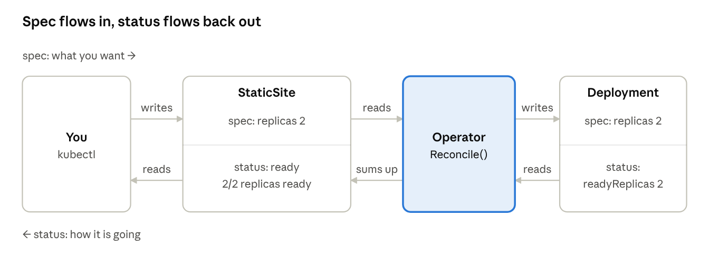
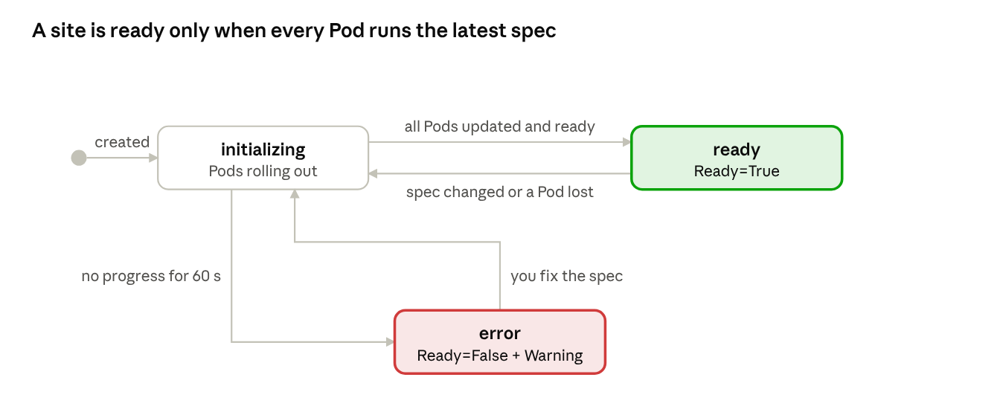

# Day 3 — Status, ownership and config changes

[← Day 2](../day-2-first-crd-and-operator/README.md) · [Day 4 →](../day-4-phpapp/README.md)

> **Finished code:** the operator as it stands at the end of the week is in [`reference/site-operator`](../reference/site-operator/). Peek when you are stuck, not before.

Yesterday's operator does the work but never says how it's going: `READY` is empty and you have to dig through Pods to find problems. Today it learns to report back (status, conditions and events), you look closely at how ownership and cleanup work, and you make page changes go live immediately.

## Today's plan

About 6 hours. Start with the kind cluster, the `site-operator` project and `my-site` from Day 2.

| Time | What you do |
| --- | --- |
| 0:20 | Big idea: a good worker reports back |
| 0:45 | Part 1 — ownership up close |
| 0:40 | Part 2 — design the report card |
| 1:00 | Part 3 — write status from Reconcile |
| 0:30 | Part 4 — events |
| 0:30 | Part 5 — roll Pods when the page changes |
| 0:45 | Part 6 — stop the needless updates |
| 0:50 | Part 7 — run it and play, troubleshooting, check yourself |

## Big idea: a good worker reports back

Imagine giving a friend a job: "set up 2 lemonade stands." A good friend doesn't just disappear. They tell you "one's up, one's still being built," or "I'm stuck, the shop is out of lemons." That report is what **status** is for.

On Day 1 you read a Deployment's report card (`status.readyReplicas`, `status.conditions`) to see if it was healthy. Today your StaticSite gets a report card of its own. The trick is that your operator doesn't measure anything itself. It reads the report cards of its children (the Deployment) and summarizes them into one answer for the user.



A good report card has four parts. Every well-built operator has them, so this is also your checklist when you troubleshoot someone else's:

| Part | Picture it as | What it really is |
| --- | --- | --- |
| `state` | A one-word mood: happy, busy, stuck | A short summary field (`initializing`, `ready`, `error`) shown in `kubectl get` |
| `conditions` | Checklist items, each ticked or not, with a reason | A list of `type` / `status` / `reason` / `message` entries, such as `Ready=True` |
| `observedGeneration` | "I've read version 7 of your instructions" | The `metadata.generation` the operator last acted on |
| Events | Sticky notes on the fridge | Short, time-stamped messages attached to the object, shown by `kubectl describe` |

## Part 1 — Ownership up close

On Day 2 one line, `SetControllerReference`, made cleanup work like magic. Before adding more code, look at exactly what that line wrote. Start `make run` in one terminal, then:

```bash
kubectl get configmap my-site -o jsonpath='{.metadata.ownerReferences}' | jq
```

You'll see something like:

```json
[{
  "apiVersion": "web.example.com/v1alpha1",
  "kind": "StaticSite",
  "name": "my-site",
  "uid": "6f1c…",
  "controller": true,
  "blockOwnerDeletion": true
}]
```

| Field | Plain meaning |
| --- | --- |
| `uid` | The owner's unique ID number. Ownership follows the **UID**, not the name: a new StaticSite called `my-site` is a *different* owner |
| `controller: true` | "This is my boss." An object can list many owners but only **one** controller. `SetControllerReference` refuses (an `AlreadyOwnedError`) if a different controller already owns it |
| `blockOwnerDeletion: true` | During a *foreground* delete, the owner waits until this child is gone |

### Three ways to delete an owner

The garbage collector is a built-in controller that cleans up children whose owner is gone. `kubectl delete` lets you choose how:

| Mode | Command | What happens |
| --- | --- | --- |
| Background (default) | `kubectl delete site my-site` | Owner disappears at once; the garbage collector removes the children right after |
| Foreground | `kubectl delete site my-site --cascade=foreground` | Owner stays, marked for deletion, until all blocking children are gone, then it goes |
| Orphan | `kubectl delete site my-site --cascade=orphan` | Owner goes; children **stay**, and their owner references are removed |

**Experiment: orphan, then adopt.**

1. Stop the operator (`Ctrl+C` on `make run`) so it doesn't interfere.
2. `kubectl delete site my-site --cascade=orphan`
3. `kubectl get deploy,svc,cm my-site`: all still there, and the site still works.
4. `kubectl get cm my-site -o jsonpath='{.metadata.ownerReferences}'`: empty. Nobody's boss.
5. `kubectl apply -f my-site.yaml`, then start `make run` again.
6. Check the owner reference once more. It's back, with a **new** `uid`.

Your operator just **adopted** the orphans: `CreateOrUpdate` found the existing objects, and `SetControllerReference` claimed them. This is how real operators survive being reinstalled without deleting customer data, and it's why choosing the delete mode matters on real systems.

**Remember for later:** if an owner is stuck in `Terminating`, the object has `metadata.deletionTimestamp` set and is waiting on something listed in `metadata.finalizers`. You'll build your own finalizer on Day 5.

## Part 2 — Design the report card

Open `api/v1alpha1/staticsite_types.go` and grow `StaticSiteStatus`:

```go
// StaticSiteStatus is what the operator reports back.
type StaticSiteStatus struct {
	// State is a one-word summary: initializing, ready or error.
	// +optional
	State string `json:"state,omitempty"`

	// ReadyReplicas is how many nginx Pods are ready.
	// +optional
	ReadyReplicas int32 `json:"readyReplicas,omitempty"`

	// ObservedGeneration is the spec generation this status describes.
	// +optional
	ObservedGeneration int64 `json:"observedGeneration,omitempty"`

	// Conditions are the detailed checklist (Ready, ...).
	// +listType=map
	// +listMapKey=type
	// +optional
	Conditions []metav1.Condition `json:"conditions,omitempty"`
}
```

And put `State` first in the `kubectl get` columns. Replace the printcolumn markers above `type StaticSite struct`:

```go
// +kubebuilder:printcolumn:name="State",type=string,JSONPath=`.status.state`
// +kubebuilder:printcolumn:name="Replicas",type=integer,JSONPath=`.spec.replicas`
// +kubebuilder:printcolumn:name="Ready",type=integer,JSONPath=`.status.readyReplicas`
// +kubebuilder:printcolumn:name="Age",type=date,JSONPath=`.metadata.creationTimestamp`
```

Then `make manifests generate install`.

### Anatomy of a condition

`metav1.Condition` is the standard shape used all over Kubernetes, so learning it once pays off everywhere:

| Field | Example | Rule of thumb |
| --- | --- | --- |
| `type` | `Ready` | A question with a yes/no answer. Write it so `True` means good |
| `status` | `True`, `False` or `Unknown` | The answer. A string, not a boolean |
| `reason` | `AllReplicasReady`, `RolloutStuck` | One CamelCase word; something scripts can match on |
| `message` | `2/2 replicas ready` | A sentence for humans |
| `lastTransitionTime` | `2026-10-05T03:12:44Z` | When `status` last *flipped*, not when it was last written |
| `observedGeneration` | `4` | Which spec generation this answer is about |

`+listType=map` and `+listMapKey=type` tell Kubernetes that each condition is identified by its `type`, so there's at most one `Ready` entry.

### Why observedGeneration matters

Every time someone changes a StaticSite's `spec`, the API server adds 1 to `metadata.generation`. Changes to `status` don't count. By copying the generation it acted on into `status.observedGeneration`, the operator answers the question everyone asks during an incident: *has it even seen my change yet?*

- `observedGeneration` < `generation` → the operator hasn't processed the latest change yet (busy, stuck, or not running).
- They're equal → the status you're reading describes the latest change.

## Part 3 — Write status from Reconcile

The operator decides its mood by reading the Deployment's report card. A StaticSite moves between three states:



### Make "stuck" show up fast

On Day 1 a bad image took 10 minutes to be declared stuck (`progressDeadlineSeconds`, default 600). For a small web server, 60 seconds is plenty. In the Deployment's `CreateOrUpdate` function, add:

```go
dep.Spec.ProgressDeadlineSeconds = ptr.To[int32](60)
```

### The report-back code

Add `"fmt"`, `"k8s.io/apimachinery/pkg/api/meta"` and `"k8s.io/utils/ptr"` to the imports. Then replace the final `return ctrl.Result{}, nil` in `Reconcile` with:

```go
	// 5. Report back: summarize the Deployment's report card.
	site.Status.ReadyReplicas = dep.Status.ReadyReplicas
	site.Status.ObservedGeneration = site.Generation
	ready := metav1.Condition{Type: "Ready", ObservedGeneration: site.Generation}
	progress := fmt.Sprintf("%d/%d replicas ready", dep.Status.ReadyReplicas, site.Spec.Replicas)

	switch {
	case isStuck(dep):
		site.Status.State = "error"
		ready.Status, ready.Reason = metav1.ConditionFalse, "RolloutStuck"
		ready.Message = "nginx Pods are not becoming ready; check the image and Pod events"
	case dep.Status.ObservedGeneration == dep.Generation &&
		dep.Status.UpdatedReplicas == site.Spec.Replicas &&
		dep.Status.ReadyReplicas == site.Spec.Replicas:
		site.Status.State = "ready"
		ready.Status, ready.Reason, ready.Message = metav1.ConditionTrue, "AllReplicasReady", progress
	default:
		site.Status.State = "initializing"
		ready.Status, ready.Reason, ready.Message = metav1.ConditionFalse, "RollingOut", progress
	}
	meta.SetStatusCondition(&site.Status.Conditions, ready)

	if err := r.Status().Update(ctx, &site); err != nil {
		return ctrl.Result{}, err
	}
	return ctrl.Result{}, nil
}

// isStuck reports whether the Deployment gave up on its rollout.
func isStuck(dep *appsv1.Deployment) bool {
	for _, c := range dep.Status.Conditions {
		if c.Type == appsv1.DeploymentProgressing &&
			c.Status == corev1.ConditionFalse &&
			c.Reason == "ProgressDeadlineExceeded" {
			return true
		}
	}
	return false
}
```

### What's going on

- **Ready means *all* of it.** The Deployment must have seen its latest spec (`observedGeneration == generation`), *and* updated every Pod, *and* have every Pod ready. Checking only `readyReplicas` would call the site "ready" in the middle of a rollout, while old Pods are still serving the old page.
- **`r.Status().Update`** writes through the `/status` door from Day 2. A plain `r.Update` would silently ignore your status changes.
- **`meta.SetStatusCondition`** adds or replaces the `Ready` entry and only changes `lastTransitionTime` when `status` actually flips. Writing the same answer twice is harmless.
- **No polling.** You never sleep or loop waiting for Pods. When the Deployment's status changes, `Owns(&appsv1.Deployment{})` wakes Reconcile up, and the report is rewritten. Events do the waiting for you.
- **Why it runs once more.** Writing status changes the StaticSite, which is itself an event. The next pass computes the same status, the API server sees no change, and things go quiet.

## Part 4 — Leave notes (events)

Status tells you how things are *now*. Events tell you *what happened*: the sticky notes you read with `kubectl describe` on Day 1. Your operator can leave its own.

**1. Give the reconciler a recorder.** In `staticsite_controller.go`, add a field to the struct:

```go
type StaticSiteReconciler struct {
	client.Client
	Scheme   *runtime.Scheme
	Recorder events.EventRecorder // import "k8s.io/client-go/tools/events"
}
```

**2. Hand it one in `cmd/main.go`**, where the reconciler is created:

```go
if err = (&controller.StaticSiteReconciler{
	Client:   mgr.GetClient(),
	Scheme:   mgr.GetScheme(),
	Recorder: mgr.GetEventRecorder("staticsite-controller"),
}).SetupWithManager(mgr); err != nil {
```

This uses the newer **events API** (`events.k8s.io/v1`), which recent controller-runtime releases hand out through `mgr.GetEventRecorder` (this course was tested on v0.25). Older operators use `record.EventRecorder` from `k8s.io/client-go/tools/record` and `mgr.GetEventRecorderFor`; the idea is the same, only the method signatures differ.

**3. Permission to write events:**

```go
// +kubebuilder:rbac:groups=events.k8s.io,resources=events,verbs=create;patch
```

**4. Leave notes only when something changes**, not on every pass, or you'll bury the useful ones. Right after the `r.Get` that reads the StaticSite, remember the old state:

```go
	prevState := site.Status.State
```

After the `meta.SetStatusCondition` line, add:

```go
	if site.Status.State != prevState {
		eventType := corev1.EventTypeNormal
		if site.Status.State == "error" {
			eventType = corev1.EventTypeWarning
		}
		r.Recorder.Eventf(&site, nil, eventType, ready.Reason, "Reconcile",
			"State is now %s: %s", site.Status.State, ready.Message)
	}
```

And after each `CreateOrUpdate`, note creations. For example, for the Deployment:

```go
	if op == controllerutil.OperationResultCreated {
		r.Recorder.Eventf(&site, dep, corev1.EventTypeNormal, "Created", "Create", "Created Deployment %s", dep.Name)
	}
```

`Eventf` takes six things before the message: the object the note is **about** (the StaticSite), a **related** object (here the child that was created, or `nil`), the type, a CamelCase **reason**, an **action** word, and the message. Passing the child as *related* matters: the events API merges events with the same object, reason and action into one series, so without it you'd see a single `Created ConfigMap (x2)` instead of separate notes for the ConfigMap and the Deployment. The reference code wraps this in a small `noteCreated` helper.

The rule of thumb: **Normal** events for progress, **Warning** events for things a human should look at.

## Part 5 — Roll Pods when the page changes

On Day 1 a new page took up to a minute to appear, because the kubelet refreshes mounted ConfigMap files on its own schedule. Many apps (nginx's own config file, PHP settings, database configs) never re-read their files at all. Operators solve both problems the same way: **put a fingerprint of the config into the Pod template.**

A fingerprint (a *hash*) is a short code computed from the content. Change one letter of the page and the code changes completely. Put that code in a Pod template annotation, and changing the page changes the template. Changing the template is exactly what makes a Deployment do a rolling update.

Add a helper (imports `"crypto/sha256"` and `"encoding/hex"`):

```go
// contentHash is a short fingerprint of the page.
func contentHash(s string) string {
	sum := sha256.Sum256([]byte(s))
	return hex.EncodeToString(sum[:8])
}
```

You'll wire it into the Deployment in Part 6 as this annotation:

```yaml
spec:
  template:
    metadata:
      annotations:
        web.example.com/content-hash: 3f9a0c1d2e4b5a69
```

This is the same trick `kubectl rollout restart` uses: it just stamps a `kubectl.kubernetes.io/restartedAt` time on the template. When you see an unexpected rollout in a customer's cluster, look for a template annotation that changed.

## Part 6 — Stop the needless updates

Yesterday's log said `updated` for the Deployment on every pass. Here's why: your function replaced the whole `Containers` list with a new one. The API server had filled in defaults inside the old one (`imagePullPolicy`, `terminationMessagePath`, …), so your copy always looked different. It's like a tidy friend who rewrites your whole shopping list every visit, just because you didn't write "(any brand)" next to each item.

The fix: **change only the fields you own, and leave everything else where it is.** Replace the Deployment's `CreateOrUpdate` function with this final version (it also adds Part 3's deadline and Part 5's hash):

```go
	op, err = controllerutil.CreateOrUpdate(ctx, r.Client, dep, func() error {
		dep.Spec.Replicas = ptr.To(site.Spec.Replicas)
		dep.Spec.ProgressDeadlineSeconds = ptr.To[int32](60)
		dep.Spec.Selector = &metav1.LabelSelector{MatchLabels: labels}
		dep.Spec.Template.Labels = labels

		if dep.Spec.Template.Annotations == nil {
			dep.Spec.Template.Annotations = map[string]string{}
		}
		dep.Spec.Template.Annotations["web.example.com/content-hash"] = contentHash(site.Spec.Content)

		pod := &dep.Spec.Template.Spec
		if len(pod.Containers) == 0 {
			pod.Containers = []corev1.Container{{Name: "nginx"}}
		}
		c := &pod.Containers[0] // edit the existing container in place
		c.Image = site.Spec.Image
		c.Ports = []corev1.ContainerPort{{ContainerPort: 80, Protocol: corev1.ProtocolTCP}}
		c.VolumeMounts = []corev1.VolumeMount{{Name: "html", MountPath: "/usr/share/nginx/html"}}

		pod.Volumes = []corev1.Volume{{
			Name: "html",
			VolumeSource: corev1.VolumeSource{ConfigMap: &corev1.ConfigMapVolumeSource{
				LocalObjectReference: corev1.LocalObjectReference{Name: site.Name},
				DefaultMode:          ptr.To[int32](0o644), // the default, spelled out
			}},
		}}
		return controllerutil.SetControllerReference(&site, dep, r.Scheme)
	})
```

And the Service's ports, with their defaults spelled out (import `"k8s.io/apimachinery/pkg/util/intstr"`):

```go
		svc.Spec.Ports = []corev1.ServicePort{{
			Port: 80, TargetPort: intstr.FromInt32(80), Protocol: corev1.ProtocolTCP,
		}}
```

Two techniques are at work here:

1. **Edit in place** (the container): keep the object the API server gave you and change only your fields. The defaults survive.
2. **Spell out the defaults** (the volume and ports): when you must write a whole list, include the values the API server would add, so your version matches the stored one exactly.

After `make run`, the log should now say `unchanged` on quiet passes. The modern alternative is **Server-Side Apply**: you send only the fields you care about, and the API server keeps track of which program owns which field (you can see this in `metadata.managedFields`). It's worth reading about once this week is done.

## Part 7 — Run it and play

Rebuild and restart:

```bash
make manifests generate install
make run
```

Keep a watch open in a second terminal for every experiment:

```bash
kubectl get site -w
```

**Experiment 1: a fresh start.** Delete and re-apply `my-site.yaml`. Watch `STATE` go from `initializing` to `ready` and `READY` count up to 2. Then read the whole report card:

```bash
kubectl describe site my-site
```

At the bottom you'll find your `Ready` condition and your own events: `Created ConfigMap`, `Created Deployment`, `State is now ready`.

**Experiment 2: a bad image.**

```bash
kubectl patch site my-site --type=merge -p '{"spec":{"image":"nginx:does-not-exist"}}'
```

`STATE` goes to `initializing`, and about a minute later to `error`. `kubectl describe site my-site` shows a **Warning** event with reason `RolloutStuck`. Meanwhile the site still serves the page, because the old Pods are kept until new ones are ready. Fix it by patching the image back to `nginx:stable` and watch it return to `ready`.

**Experiment 3: has it seen my change?** Stop the operator (`Ctrl+C`), then:

```bash
kubectl patch site my-site --type=merge -p '{"spec":{"replicas":3}}'
kubectl get site my-site -o jsonpath='{.metadata.generation} {.status.observedGeneration}{"\n"}'
```

The two numbers differ: the spec has moved on, and the report card is out of date. Start `make run` again and re-check. They match within seconds. Make this the first thing you check whenever a custom resource "isn't doing anything."

**Experiment 4: instant page changes.** Edit the page text in `my-site.yaml` and apply it, then:

```bash
kubectl rollout status deployment/my-site
kubectl get deploy my-site -o jsonpath='{.spec.template.metadata.annotations}'
```

A rolling update starts right away because the hash changed. Compare that with Day 1's one-minute wait.

**Experiment 5: scripts can wait too.**

```bash
kubectl wait --for=condition=Ready site/my-site --timeout=120s
```

This only works because you used a standard condition. CI pipelines and other tools rely on exactly this.

**Experiment 6: quiet logs.** Leave everything alone for a minute and read the operator log. Quiet passes should now report `unchanged` for every child.

## Troubleshooting corner

| What you see | Usual cause | What to do |
| --- | --- | --- |
| `the object has been modified; please apply your changes to the latest version` in the log | A **conflict**: something else changed the object between your read and your write | Usually harmless: returning the error requeues, and the next pass reads the fresh copy. Worry only if it repeats non-stop, which means two writers are fighting |
| Status never appears | Using `r.Update` instead of `r.Status().Update`, or the CRD lacks the status subresource | Check the call and the `+kubebuilder:subresource:status` marker; `make manifests install` |
| `STATE` column empty after adding the field | Old CRD still installed | `make manifests install` |
| `generation` > `observedGeneration` for a long time | Operator not running, crashing, or erroring before it reaches the status write | Check the operator's Pod and logs; find the first error |
| Event spam: the same message over and over | Emitting events on every pass instead of on change | Compare with the previous state before emitting |
| `AlreadyOwnedError` / "object is already owned by another controller" | The child already has a different controller owner | Find who owns it in `ownerReferences`; two operators are fighting over the same object |
| Rollout every few seconds | Something in the Pod template changes every pass (e.g. a timestamp in an annotation) | Compare two versions of the template; only put stable values there |
| Children survived deleting the owner | It was deleted with `--cascade=orphan`, or the owner reference has the wrong UID | Check `ownerReferences` on the child |

## Check yourself

1. Your operator never measures Pods itself. Where does its status come from?
2. Why isn't `readyReplicas == replicas` enough to call a site ready?
3. A user says "I changed the CR an hour ago and nothing happened." What's the first thing you compare, and what does each outcome tell you?
4. Why must status be written with `r.Status().Update` and not `r.Update`?
5. What's the difference between `--cascade=orphan` and the default delete? When would you want orphan?
6. Why does changing an annotation on the Pod template cause a rollout, and why is that useful?
7. Why did Day 2's operator report `updated` every pass, and what are two ways to fix it?
8. Why should an operator emit events only when something changes?

**Answers**

1. From its children's status: it reads the Deployment's `readyReplicas`, `updatedReplicas`, `observedGeneration` and conditions, and summarizes them.
2. During a rollout, old Pods are still ready and serving the old version. You also need the Deployment to have seen its latest spec and to have updated every replica.
3. `metadata.generation` vs `status.observedGeneration`. Lower `observedGeneration`: the operator hasn't processed the change (down, stuck or erroring), so check its logs. Equal: it processed the change, so read the conditions and events to see what it decided.
4. Because of the status subresource: normal updates ignore `status`, and only writes to `/status` can change it.
5. The default removes the children too; orphan keeps them and just removes the owner references. Use orphan when you need to remove or reinstall the owner without touching what it built, such as running workloads or data.
6. Any change to the Pod template makes the Deployment roll out new Pods. Putting a hash of the config there turns "config changed" into "restart with the new config."
7. It replaced whole lists, wiping defaults the API server had filled in. Fix by editing objects in place and spelling out defaults when you write whole lists, or use Server-Side Apply.
8. Events are for humans scanning `describe`. Repeated identical events bury the one that matters, and they add load on the API server.

## Keep for Day 4

Keep the cluster and `site-operator` project. Tomorrow you'll start a second operator, **PhpApp**, with two parts (nginx and php-fpm) that must be set up in the right order and talk to each other. Everything from today (status, conditions, events and hashes) carries straight over.

---

[← Day 2](../day-2-first-crd-and-operator/README.md) · [Day 4 →](../day-4-phpapp/README.md)
