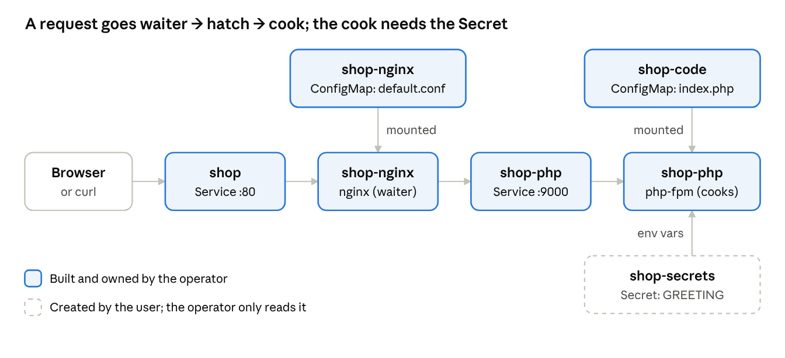
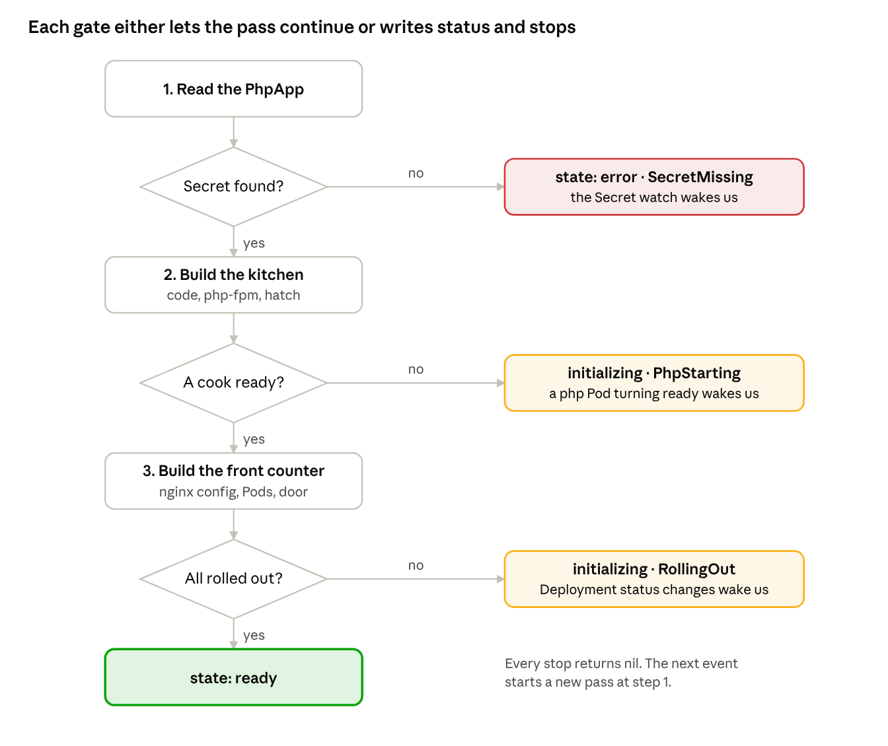

# Day 4 — PhpApp: two parts that depend on each other

[← Day 3](../day-3-status-and-ownership/README.md) · [Day 5 →](../day-5-cleanup-tests-shipping/README.md)

> **Lab files:** every YAML file in this lesson is ready-made in [`labs/day4/`](../labs/day4/): [`shop.yaml`](../labs/day4/shop.yaml). Type them yourself the first time; use these to check your work.

> **Finished code:** the operator as it stands at the end of the week is in [`reference/site-operator`](../reference/site-operator/). Peek when you are stuck, not before.

StaticSite had one moving part. Real operators manage several parts that must start in the right order, find each other, and share secrets. Today you build **PhpApp**: nginx in front, php-fpm behind it, and a password-style Secret the PHP code needs. It's the same shape as a database cluster with a proxy in front, just small enough to finish in a day.

## Today's plan

About 6½ hours. You'll add PhpApp to the same `site-operator` project, so StaticSite keeps working alongside it.

| Time | What you do |
| --- | --- |
| 0:20 | Big idea: a waiter and a cook |
| 0:40 | Part 1 — design the PhpApp API |
| 0:30 | Part 2 — plan the order of work |
| 1:00 | Part 3 — the kitchen (php-fpm) |
| 0:45 | Part 4 — the front counter (nginx) |
| 0:45 | Part 5 — glue it together |
| 0:30 | Part 6 — watch the Secret |
| 1:00 | Part 7 — run it and play, troubleshooting, check yourself |

## Big idea: a waiter and a cook

Think of a small restaurant. The **waiter** stands at the front, greets customers and carries orders to the kitchen through a hatch. The **cook** in the kitchen actually makes the food, using a recipe and a secret ingredient kept in a locked box.

A PHP website works the same way:

| Restaurant | PhpApp | What it really is |
| --- | --- | --- |
| Waiter | nginx | A web server that accepts HTTP requests and forwards PHP requests onward |
| Cook | php-fpm | "PHP FastCGI Process Manager": a pool of PHP workers that run your `.php` code |
| The hatch | The php Service on port 9000 | A stable address nginx uses to reach the php-fpm Pods, speaking the **FastCGI** protocol |
| Recipe | Code ConfigMap | Your `index.php`, mounted into the php-fpm Pods |
| Waiter's instructions | nginx ConfigMap | `default.conf`, telling nginx where the hatch is |
| Secret ingredient | A Secret | A value (like a password or API key) passed to PHP as an environment variable |



The new problems today are the ones every multi-part operator faces:

1. **Order.** nginx looks up the hatch's address when it starts. If the php Service doesn't exist yet, nginx crashes with `host not found in upstream`. So some things must exist before others.
2. **Dependencies the operator doesn't own.** The Secret is created by a human, not by the operator. If it's missing, the operator must say so clearly, and notice the moment it appears.
3. **Telling parts apart.** Two Deployments from one custom resource need different labels, or a Service will send customers into the kitchen.

## Part 1 — Design the PhpApp API

Good operator design starts from the user's side: what's the *shortest* file that says everything that matters? Here's what a PhpApp user should write:

```yaml
apiVersion: web.example.com/v1alpha1
kind: PhpApp
metadata:
  name: shop
spec:
  secretName: shop-secrets        # a Secret the user creates; every key becomes an env var
  code: |
    <?php
    echo "<h1>" . htmlspecialchars(getenv("GREETING")) . "</h1>";
    echo "<p>Cooked by " . gethostname() . "</p>";
  php:
    replicas: 2                   # image defaults to php:8.3-fpm
  nginx:
    replicas: 1                   # image defaults to nginx:stable
```

Notice what the user does **not** write: ports, labels, Service names, the nginx config, mount paths. Those are the operator's business. Every field you leave out of the API is a mistake users can't make, and a support case you won't get.

### Scaffold and write the types

In the `site-operator` folder:

```bash
kubebuilder create api --group web --version v1alpha1 --kind PhpApp
```

Answer `y` to both questions. Then edit `api/v1alpha1/phpapp_types.go`:

```go
// ComponentSpec is shared by the php and nginx parts.
type ComponentSpec struct {
	// +optional
	Image string `json:"image,omitempty"`

	// +kubebuilder:validation:Minimum=1
	// +kubebuilder:validation:Maximum=10
	// +kubebuilder:default=1
	// +optional
	Replicas int32 `json:"replicas,omitempty"`
}

// PhpAppSpec is what the user asks for.
type PhpAppSpec struct {
	// Code is the content of index.php.
	// +kubebuilder:validation:MinLength=1
	Code string `json:"code"`

	// SecretName names a Secret whose keys become env vars for PHP.
	// +kubebuilder:validation:MinLength=1
	SecretName string `json:"secretName"`

	// +kubebuilder:default={}
	// +optional
	Php ComponentSpec `json:"php,omitempty"`

	// +kubebuilder:default={}
	// +optional
	Nginx ComponentSpec `json:"nginx,omitempty"`
}

// PhpAppStatus is what the operator reports back.
type PhpAppStatus struct {
	// +optional
	State string `json:"state,omitempty"`
	// +optional
	ObservedGeneration int64 `json:"observedGeneration,omitempty"`
	// +listType=map
	// +listMapKey=type
	// +optional
	Conditions []metav1.Condition `json:"conditions,omitempty"`
}
```

Above `type PhpApp struct`, add the markers you know from Day 3:

```go
// +kubebuilder:subresource:status
// +kubebuilder:resource:shortName=php
// +kubebuilder:printcolumn:name="State",type=string,JSONPath=`.status.state`
// +kubebuilder:printcolumn:name="Age",type=date,JSONPath=`.metadata.creationTimestamp`
```

Two new ideas:

- **`+kubebuilder:default={}` on a nested struct.** Defaults inside `php` only get applied if `php` itself exists. Defaulting it to an empty object means a user can leave out `php:` entirely and still get `replicas: 1`.
- **Image defaults live in code, not the schema.** We'll fill in `php:8.3-fpm` and `nginx:stable` in Go when the field is empty. That lets you move to a newer default image in a new operator release without changing every user's stored object, which is how most real operators handle versions.

Run `make manifests generate install`.

## Part 2 — Plan the order of work

Before writing code, decide the order in which things get built and where the operator should stop and wait. Think of it as opening the restaurant: check you have the secret ingredient, set up the kitchen, wait until a cook is actually ready, then open the front door.



Two rules make this work:

- **Stopping early is normal.** A pass that ends at a gate isn't a failure. It writes an honest status ("waiting for the Secret", "php starting") and returns. The next event, such as a Pod becoming ready or the Secret appearing, starts a new pass from the top. You never write a loop that waits.
- **Gates are checked every pass.** Because the operator always starts from the top, the gates also protect a running app. If someone deletes the Secret later, the next pass reports it straight away.

### Names and labels

Six objects come from one PhpApp. Every name is derived from the PhpApp's name, so two PhpApps in one namespace never collide:

| Object | Name (for `shop`) | Labels / selector |
| --- | --- | --- |
| Code ConfigMap | `shop-code` | `app: shop` |
| php-fpm Deployment | `shop-php` | `app: shop`, `component: php` |
| php-fpm Service (the hatch) | `shop-php`, port 9000 | selects `component: php` |
| nginx ConfigMap | `shop-nginx` | `app: shop` |
| nginx Deployment | `shop-nginx` | `app: shop`, `component: nginx` |
| nginx Service (the front door) | `shop`, port 80 | selects `component: nginx` |

The `component` label is what keeps the waiter and the cook apart. If both Deployments only had `app: shop`, the front-door Service would send some browser requests straight to php-fpm, which doesn't speak HTTP, and users would see random connection errors. This is one of the most common bugs in hand-written operators and Helm charts.

## Part 3 — The kitchen (php-fpm)

To keep `Reconcile` readable, each part of the restaurant gets its own helper function that builds its three objects and hands back the Deployment, so `Reconcile` can read its report card. All of today's code goes in `internal/controller/phpapp_controller.go`. It's in the same Go package as StaticSite, so you can reuse `contentHash` and `isStuck` from Days 2–3.

First, a few shared helpers:

```go
const (
	defaultPhpImage   = "php:8.3-fpm"
	defaultNginxImage = "nginx:stable"
	codeDir           = "/var/www/html" // where php-fpm finds index.php
)

func labelsFor(app *webv1alpha1.PhpApp, component string) map[string]string {
	return map[string]string{"app": app.Name, "component": component}
}

func imageOr(image, fallback string) string {
	if image == "" {
		return fallback
	}
	return image
}

// tcpProbe checks that something is listening on a port.
// Every default is spelled out so CreateOrUpdate sees no difference (Day 3, Part 6).
func tcpProbe(port int32) *corev1.Probe {
	return &corev1.Probe{
		ProbeHandler:     corev1.ProbeHandler{TCPSocket: &corev1.TCPSocketAction{Port: intstr.FromInt32(port)}},
		PeriodSeconds:    5,
		TimeoutSeconds:   1,
		SuccessThreshold: 1,
		FailureThreshold: 3,
	}
}
```

Now the kitchen itself:

```go
// ensurePhp builds the kitchen: code ConfigMap, php-fpm Deployment and Service.
func (r *PhpAppReconciler) ensurePhp(ctx context.Context, app *webv1alpha1.PhpApp, secret *corev1.Secret) (*appsv1.Deployment, error) {
	// The recipe.
	cm := &corev1.ConfigMap{ObjectMeta: metav1.ObjectMeta{Name: app.Name + "-code", Namespace: app.Namespace}}
	if _, err := controllerutil.CreateOrUpdate(ctx, r.Client, cm, func() error {
		cm.Labels = map[string]string{"app": app.Name}
		cm.Data = map[string]string{"index.php": app.Spec.Code}
		return controllerutil.SetControllerReference(app, cm, r.Scheme)
	}); err != nil {
		return nil, err
	}

	// The cooks.
	labels := labelsFor(app, "php")
	dep := &appsv1.Deployment{ObjectMeta: metav1.ObjectMeta{Name: app.Name + "-php", Namespace: app.Namespace}}
	if _, err := controllerutil.CreateOrUpdate(ctx, r.Client, dep, func() error {
		dep.Spec.Replicas = ptr.To(app.Spec.Php.Replicas)
		dep.Spec.ProgressDeadlineSeconds = ptr.To[int32](60)
		dep.Spec.Selector = &metav1.LabelSelector{MatchLabels: labels}
		dep.Spec.Template.Labels = labels

		// Restart the cooks when the recipe or the secret ingredient changes.
		if dep.Spec.Template.Annotations == nil {
			dep.Spec.Template.Annotations = map[string]string{}
		}
		dep.Spec.Template.Annotations["web.example.com/code-hash"] = contentHash(app.Spec.Code)
		dep.Spec.Template.Annotations["web.example.com/secret-version"] = secret.ResourceVersion

		pod := &dep.Spec.Template.Spec
		if len(pod.Containers) == 0 {
			pod.Containers = []corev1.Container{{Name: "php-fpm"}}
		}
		c := &pod.Containers[0]
		c.Image = imageOr(app.Spec.Php.Image, defaultPhpImage)
		c.Ports = []corev1.ContainerPort{{Name: "fastcgi", ContainerPort: 9000, Protocol: corev1.ProtocolTCP}}
		c.EnvFrom = []corev1.EnvFromSource{{SecretRef: &corev1.SecretEnvSource{
			LocalObjectReference: corev1.LocalObjectReference{Name: secret.Name},
		}}}
		c.VolumeMounts = []corev1.VolumeMount{{Name: "code", MountPath: codeDir}}
		c.ReadinessProbe = tcpProbe(9000)

		pod.Volumes = []corev1.Volume{{
			Name: "code",
			VolumeSource: corev1.VolumeSource{ConfigMap: &corev1.ConfigMapVolumeSource{
				LocalObjectReference: corev1.LocalObjectReference{Name: cm.Name},
				DefaultMode:          ptr.To[int32](0o644),
			}},
		}}
		return controllerutil.SetControllerReference(app, dep, r.Scheme)
	}); err != nil {
		return nil, err
	}

	// The hatch.
	svc := &corev1.Service{ObjectMeta: metav1.ObjectMeta{Name: app.Name + "-php", Namespace: app.Namespace}}
	if _, err := controllerutil.CreateOrUpdate(ctx, r.Client, svc, func() error {
		svc.Labels = map[string]string{"app": app.Name}
		svc.Spec.Selector = labels
		svc.Spec.Ports = []corev1.ServicePort{{
			Name: "fastcgi", Port: 9000, TargetPort: intstr.FromInt32(9000), Protocol: corev1.ProtocolTCP,
		}}
		return controllerutil.SetControllerReference(app, svc, r.Scheme)
	}); err != nil {
		return nil, err
	}
	return dep, nil
}
```

What's new compared with StaticSite:

- **`EnvFrom` + `SecretRef`** turns every key in the Secret into an environment variable inside php-fpm, so `GREETING` becomes `getenv("GREETING")`. The official `php:*-fpm` images pass environment variables through to PHP. Other images may not (look for `clear_env` in the php-fpm config).
- **A readiness probe.** Without one, Kubernetes marks a Pod ready as soon as its container starts, before php-fpm is listening. Your gates depend on "ready" meaning *really* ready.
- **Restart on Secret change.** Environment variables are read only when a container starts, so a changed Secret does nothing until the Pods restart. Stamping the Secret's `resourceVersion` on the Pod template turns "Secret changed" into a rollout. Many production operators hash the Secret's data instead, so that unrelated metadata changes don't restart anything.

## Part 4 — The front counter (nginx)

The waiter needs one instruction card: "send every order through the hatch called `shop-php`, port 9000, and ask the cook to run `index.php`." The operator writes that card itself, because the hatch's name depends on the PhpApp's name:

```go
// nginxConfig is the waiter's instruction card.
func nginxConfig(app *webv1alpha1.PhpApp) string {
	return fmt.Sprintf(`server {
    listen 80;
    location / {
        include fastcgi_params;
        fastcgi_param SCRIPT_FILENAME %s/index.php;
        fastcgi_pass %s-php:9000;
    }
}
`, codeDir, app.Name)
}
```

Read it line by line:

| Line | Meaning |
| --- | --- |
| `listen 80;` | Take orders at the front door |
| `include fastcgi_params;` | Pass along the standard details of the request (method, query string, headers) |
| `fastcgi_param SCRIPT_FILENAME ...` | Tell the cook which file to run. This path must exist **inside the php-fpm container**, not inside nginx |
| `fastcgi_pass shop-php:9000;` | The hatch: the php Service's name and port |

Now the helper, which follows the same pattern as the kitchen:

```go
// ensureNginx builds the front counter: config ConfigMap, nginx Deployment and Service.
func (r *PhpAppReconciler) ensureNginx(ctx context.Context, app *webv1alpha1.PhpApp) (*appsv1.Deployment, error) {
	conf := nginxConfig(app)

	cm := &corev1.ConfigMap{ObjectMeta: metav1.ObjectMeta{Name: app.Name + "-nginx", Namespace: app.Namespace}}
	if _, err := controllerutil.CreateOrUpdate(ctx, r.Client, cm, func() error {
		cm.Labels = map[string]string{"app": app.Name}
		cm.Data = map[string]string{"default.conf": conf}
		return controllerutil.SetControllerReference(app, cm, r.Scheme)
	}); err != nil {
		return nil, err
	}

	labels := labelsFor(app, "nginx")
	dep := &appsv1.Deployment{ObjectMeta: metav1.ObjectMeta{Name: app.Name + "-nginx", Namespace: app.Namespace}}
	if _, err := controllerutil.CreateOrUpdate(ctx, r.Client, dep, func() error {
		dep.Spec.Replicas = ptr.To(app.Spec.Nginx.Replicas)
		dep.Spec.ProgressDeadlineSeconds = ptr.To[int32](60)
		dep.Spec.Selector = &metav1.LabelSelector{MatchLabels: labels}
		dep.Spec.Template.Labels = labels

		// nginx never re-reads its config by itself: restart it when the card changes.
		if dep.Spec.Template.Annotations == nil {
			dep.Spec.Template.Annotations = map[string]string{}
		}
		dep.Spec.Template.Annotations["web.example.com/config-hash"] = contentHash(conf)

		pod := &dep.Spec.Template.Spec
		if len(pod.Containers) == 0 {
			pod.Containers = []corev1.Container{{Name: "nginx"}}
		}
		c := &pod.Containers[0]
		c.Image = imageOr(app.Spec.Nginx.Image, defaultNginxImage)
		c.Ports = []corev1.ContainerPort{{Name: "http", ContainerPort: 80, Protocol: corev1.ProtocolTCP}}
		c.VolumeMounts = []corev1.VolumeMount{{Name: "conf", MountPath: "/etc/nginx/conf.d"}}
		c.ReadinessProbe = tcpProbe(80)

		pod.Volumes = []corev1.Volume{{
			Name: "conf",
			VolumeSource: corev1.VolumeSource{ConfigMap: &corev1.ConfigMapVolumeSource{
				LocalObjectReference: corev1.LocalObjectReference{Name: cm.Name},
				DefaultMode:          ptr.To[int32](0o644),
			}},
		}}
		return controllerutil.SetControllerReference(app, dep, r.Scheme)
	}); err != nil {
		return nil, err
	}

	svc := &corev1.Service{ObjectMeta: metav1.ObjectMeta{Name: app.Name, Namespace: app.Namespace}}
	if _, err := controllerutil.CreateOrUpdate(ctx, r.Client, svc, func() error {
		svc.Labels = map[string]string{"app": app.Name}
		svc.Spec.Selector = labels
		svc.Spec.Ports = []corev1.ServicePort{{
			Name: "http", Port: 80, TargetPort: intstr.FromInt32(80), Protocol: corev1.ProtocolTCP,
		}}
		return controllerutil.SetControllerReference(app, svc, r.Scheme)
	}); err != nil {
		return nil, err
	}
	return dep, nil
}
```

Two details worth noticing:

- Mounting the ConfigMap at `/etc/nginx/conf.d` **replaces** that whole folder, including the image's built-in `default.conf`. That's deliberate: only your card is left. Mounting a ConfigMap over a folder that holds files the app needs is a classic "it worked before I added the volume" bug.
- The hash is of the *generated* config, not of anything the user typed. If a future operator version changes `nginxConfig`, every nginx Pod rolls automatically after the upgrade. That's handy, but it's also why an operator upgrade can restart Pods the user never touched.

## Part 5 — Glue it together

### Imports, struct and permissions

The imports `phpapp_controller.go` needs (keep any the scaffold already has):

```go
import (
	"context"
	"fmt"

	appsv1 "k8s.io/api/apps/v1"
	corev1 "k8s.io/api/core/v1"
	apierrors "k8s.io/apimachinery/pkg/api/errors"
	"k8s.io/apimachinery/pkg/api/meta"
	metav1 "k8s.io/apimachinery/pkg/apis/meta/v1"
	"k8s.io/apimachinery/pkg/runtime"
	"k8s.io/apimachinery/pkg/types"
	"k8s.io/apimachinery/pkg/util/intstr"
	"k8s.io/client-go/tools/events"
	"k8s.io/utils/ptr"
	ctrl "sigs.k8s.io/controller-runtime"
	"sigs.k8s.io/controller-runtime/pkg/client"
	"sigs.k8s.io/controller-runtime/pkg/controller/controllerutil"
	"sigs.k8s.io/controller-runtime/pkg/handler"
	"sigs.k8s.io/controller-runtime/pkg/reconcile"

	webv1alpha1 "example.com/site-operator/api/v1alpha1"
)
```

Add `Recorder events.EventRecorder` to `PhpAppReconciler`, and pass `mgr.GetEventRecorder("phpapp-controller")` in `cmd/main.go`, exactly as on Day 3. Then the permissions. Keep the generated `phpapps` lines and add:

```go
// +kubebuilder:rbac:groups=apps,resources=deployments,verbs=get;list;watch;create;update;patch;delete
// +kubebuilder:rbac:groups="",resources=services;configmaps,verbs=get;list;watch;create;update;patch;delete
// +kubebuilder:rbac:groups="",resources=secrets,verbs=get;list;watch
// +kubebuilder:rbac:groups=events.k8s.io,resources=events,verbs=create;patch
```

Note the operator can only **read** Secrets. It never needs to change the user's secret, so it isn't allowed to. Asking for the fewest permissions possible is called **least privilege**.

### Status helpers

```go
// setCond adds or replaces one condition on the PhpApp.
func setCond(app *webv1alpha1.PhpApp, condType string, ok bool, reason, msg string) {
	status := metav1.ConditionFalse
	if ok {
		status = metav1.ConditionTrue
	}
	meta.SetStatusCondition(&app.Status.Conditions, metav1.Condition{
		Type: condType, Status: status, Reason: reason, Message: msg,
		ObservedGeneration: app.Generation,
	})
}

// rolledOut: the Deployment has seen its latest spec and every Pod is updated and ready.
func rolledOut(dep *appsv1.Deployment, want int32) bool {
	return dep.Status.ObservedGeneration == dep.Generation &&
		dep.Status.UpdatedReplicas == want &&
		dep.Status.ReadyReplicas == want
}

// report writes the summary state, the Ready condition and, on change, an event.
func (r *PhpAppReconciler) report(ctx context.Context, app *webv1alpha1.PhpApp,
	prev, state, reason, msg string) (ctrl.Result, error) {
	app.Status.State = state
	app.Status.ObservedGeneration = app.Generation
	setCond(app, "Ready", state == "ready", reason, msg)
	if state != prev {
		eventType := corev1.EventTypeNormal
		if state == "error" {
			eventType = corev1.EventTypeWarning
		}
		r.Recorder.Eventf(app, nil, eventType, reason, "Reconcile", "State is now %s: %s", state, msg)
	}
	return ctrl.Result{}, r.Status().Update(ctx, app)
}
```

### Reconcile: the plan from Part 2, in code

```go
func (r *PhpAppReconciler) Reconcile(ctx context.Context, req ctrl.Request) (ctrl.Result, error) {
	var app webv1alpha1.PhpApp
	if err := r.Get(ctx, req.NamespacedName, &app); err != nil {
		return ctrl.Result{}, client.IgnoreNotFound(err)
	}
	prev := app.Status.State

	// Gate 1: is the secret ingredient in the cupboard?
	var secret corev1.Secret
	err := r.Get(ctx, types.NamespacedName{Namespace: app.Namespace, Name: app.Spec.SecretName}, &secret)
	if apierrors.IsNotFound(err) {
		msg := fmt.Sprintf("Secret %q does not exist", app.Spec.SecretName)
		setCond(&app, "SecretFound", false, "SecretMissing", msg)
		return r.report(ctx, &app, prev, "error", "SecretMissing", msg)
	}
	if err != nil {
		return ctrl.Result{}, err // a real error: retry with backoff
	}
	setCond(&app, "SecretFound", true, "SecretFound", "")

	// Step 2: build the kitchen.
	php, err := r.ensurePhp(ctx, &app, &secret)
	if err != nil {
		return ctrl.Result{}, err
	}
	if isStuck(php) {
		return r.report(ctx, &app, prev, "error", "PhpRolloutStuck", "php-fpm Pods are not becoming ready")
	}

	// Gate 2: at least one cook ready before opening the front door.
	if php.Status.ReadyReplicas == 0 {
		setCond(&app, "PhpReady", false, "Starting", "no php-fpm Pod is ready yet")
		return r.report(ctx, &app, prev, "initializing", "PhpStarting", "waiting for php-fpm")
	}
	setCond(&app, "PhpReady", true, "PodsReady", fmt.Sprintf("%d php-fpm Pods ready", php.Status.ReadyReplicas))

	// Step 3: build the front counter.
	nginx, err := r.ensureNginx(ctx, &app)
	if err != nil {
		return ctrl.Result{}, err
	}
	if isStuck(nginx) {
		return r.report(ctx, &app, prev, "error", "NginxRolloutStuck", "nginx Pods are not becoming ready")
	}

	// Gate 3: is everything fully rolled out?
	if !rolledOut(php, app.Spec.Php.Replicas) || !rolledOut(nginx, app.Spec.Nginx.Replicas) {
		return r.report(ctx, &app, prev, "initializing", "RollingOut", "waiting for all Pods to be updated and ready")
	}
	return r.report(ctx, &app, prev, "ready", "AllReady", "nginx and php-fpm are ready")
}
```

Read it top to bottom and match each block to the drawing in Part 2. Notice the two different kinds of "not now":

- **A problem in the world** (missing Secret, Pods not ready yet) → write status and return `nil`. Nothing is broken in the operator; it's waiting for an event.
- **A problem talking to Kubernetes** (the `r.Get` or `CreateOrUpdate` call failed) → return the error. controller-runtime retries with backoff.

Mixing these up is a common operator bug: returning errors for normal waiting fills the logs with scary messages and backoff, while swallowing real errors hides them.

## Part 6 — Watch the Secret

Gate 1 returns quietly when the Secret is missing. But who wakes the operator up when the user finally creates it? Not `Owns`: that only works for objects with *your* owner reference, and the Secret belongs to the user. You need a different kind of watch, one that answers the question **"this Secret changed, which PhpApps care?"**

```go
// appsUsingSecret maps a changed Secret to the PhpApps that use it.
func (r *PhpAppReconciler) appsUsingSecret(ctx context.Context, obj client.Object) []reconcile.Request {
	var apps webv1alpha1.PhpAppList
	if err := r.List(ctx, &apps, client.InNamespace(obj.GetNamespace())); err != nil {
		return nil
	}
	var requests []reconcile.Request
	for _, app := range apps.Items {
		if app.Spec.SecretName == obj.GetName() {
			requests = append(requests, reconcile.Request{
				NamespacedName: types.NamespacedName{Namespace: app.Namespace, Name: app.Name},
			})
		}
	}
	return requests
}

func (r *PhpAppReconciler) SetupWithManager(mgr ctrl.Manager) error {
	return ctrl.NewControllerManagedBy(mgr).
		For(&webv1alpha1.PhpApp{}).
		Owns(&appsv1.Deployment{}).
		Owns(&corev1.Service{}).
		Owns(&corev1.ConfigMap{}).
		Watches(&corev1.Secret{}, handler.EnqueueRequestsFromMapFunc(r.appsUsingSecret)).
		Named("phpapp").
		Complete(r)
}
```

There are four ways an operator can learn that something changed. Knowing which one an operator uses explains how quickly it reacts:

| Way | How it finds the custom resource | Use it for |
| --- | --- | --- |
| `For(...)` | It *is* the custom resource | Your own kind |
| `Owns(...)` | Follows the child's owner reference up | Things you created |
| `Watches(..., MapFunc)` | Your function looks it up | Things you depend on but don't own: Secrets, ConfigMaps, Nodes |
| (no watch) `RequeueAfter` | Re-checks on a timer | Things outside Kubernetes, like a cloud API or a backup bucket |

Two trade-offs to know about, because real operators run into both:

- **Watching Secrets caches every Secret** the operator is allowed to see, in memory. In a big cluster that's a lot of memory, plus permission to read everyone's secrets. Production operators often narrow it down, for example by only watching Secrets that carry a certain label.
- **The map function lists all PhpApps** on every Secret change. That's fine for a handful. For thousands, you'd add a *field index* on `spec.secretName` so the lookup is instant.

Run `make manifests generate install` and start `make run`.

## Part 7 — Run it and play

Save Part 1's example as `shop.yaml`. Keep two watches open:

```bash
kubectl get php -w
kubectl get deploy -l app=shop -w
```

**Experiment 1: the missing ingredient.** Apply `shop.yaml` *before* creating the Secret:

```bash
kubectl apply -f shop.yaml
kubectl describe php shop
```

`STATE` is `error`. The conditions show `SecretFound=False` with reason `SecretMissing`, and there's a **Warning** event. No Deployments exist: gate 1 stopped everything. The operator log shows no errors or retries, because this is waiting, not failing.

**Experiment 2: the ingredient arrives.**

```bash
kubectl create secret generic shop-secrets --from-literal=GREETING="Welcome to the shop"
```

The operator reacts at once, thanks to the Secret watch from Part 6. Watch the Deployment list: `shop-php` appears first, and `shop-nginx` only appears once a php-fpm Pod is ready (gate 2). `STATE` goes `initializing` → `ready`.

**Experiment 3: visit the shop.**

```bash
kubectl port-forward svc/shop 8080:80
for i in 1 2 3 4 5 6; do curl -s localhost:8080; echo; done
```

You'll see your greeting and a "Cooked by" line naming a php-fpm Pod. The name may change between requests as the hatch (the php Service) spreads orders across the cooks.

**Experiment 4: change the secret ingredient.**

```bash
kubectl create secret generic shop-secrets --from-literal=GREETING="Now with fries" \
  --dry-run=client -o yaml | kubectl apply -f -
```

Only `shop-php` rolls out, because its `secret-version` annotation changed. `shop-nginx` is untouched. A minute later the page says "Now with fries."

**Experiment 5: the 502.** Stop the operator (`Ctrl+C`), then remove the kitchen:

```bash
kubectl delete deployment shop-php
curl -i localhost:8080      # restart the port-forward if needed
```

You get **`502 Bad Gateway`**. nginx is fine; it just has nobody behind the hatch. Learn this one by heart: a 502 from a proxy almost always means "the thing behind me isn't answering." Start `make run` again and the kitchen comes back.

**Experiment 6: a bad cook.**

```bash
kubectl patch php shop --type=merge -p '{"spec":{"php":{"image":"php:does-not-exist"}}}'
```

After about a minute, `STATE` is `error` with reason `PhpRolloutStuck`, yet the shop keeps serving: the old php Pods stay until new ones are ready. Patch the image back to `php:8.3-fpm`.

**Experiment 7: the Secret disappears.**

```bash
kubectl delete secret shop-secrets
kubectl rollout restart deployment shop-php
kubectl get pods -l component=php
```

The PhpApp goes to `error` straight away. The running cooks were fine (they read the value when they started), but the restarted Pods are stuck in `CreateContainerConfigError`, because their Secret is gone. Recreate the Secret and watch everything recover. This is exactly why an operator should check dependencies itself and say so in status, instead of leaving users to discover it Pod by Pod.

## Troubleshooting corner

Multi-part apps fail *between* the parts. When something breaks, find which link in the chain is broken: browser → nginx Service → nginx → php Service → php-fpm → code and Secret.

| What you see | Where to look | Usual cause |
| --- | --- | --- |
| `502 Bad Gateway` | `kubectl get endpointslices -l kubernetes.io/service-name=shop-php` | No ready php-fpm Pods behind the hatch, or the hatch's selector doesn't match them |
| nginx in `CrashLoopBackOff`, log says `host not found in upstream "shop-php"` | `kubectl logs deploy/shop-nginx` | The php Service doesn't exist (yet), or the name in `fastcgi_pass` is wrong. This is why the order matters |
| Page says `File not found.` and the php-fpm log says `Primary script unknown` | php-fpm logs; `kubectl exec deploy/shop-php -- ls /var/www/html` | `SCRIPT_FILENAME` points to a path that doesn't exist inside the php-fpm container |
| Pod stuck in `CreateContainerConfigError` | `kubectl describe pod` → Events | A Secret or ConfigMap the Pod needs is missing |
| `getenv()` returns nothing | `kubectl exec deploy/shop-php -- env` | Key name differs from what the code asks for, or the php-fpm config has `clear_env = yes` |
| Secret changed but the app still shows the old value | Pod template annotations | Env vars are only read at start, so something must restart the Pods. Our operator stamps the Secret version; many tools don't |
| Random connection resets or garbage responses | Service selectors vs Pod labels | A Service selects Pods of *both* components |
| Operator log: `secrets is forbidden ... cannot list resource "secrets"` (in-cluster only) | `config/rbac/role.yaml` | Missing RBAC marker for Secrets |
| PhpApp says `error` / `SecretMissing` but the Secret exists | Namespace and exact name | The Secret is in a different namespace, or the name has a typo |

## Check yourself

1. Why must the php Service exist before the nginx Pods start?
2. Why does the operator use `Owns` for Deployments but `Watches` with a map function for the Secret?
3. Why don't you write a loop that waits until php-fpm is ready?
4. A missing Secret writes status and returns `nil`, but a failed `CreateOrUpdate` returns an error. Why the difference?
5. A user gets `502 Bad Gateway`. Name the first command you'd run and what you're looking for.
6. What goes wrong if both Deployments only carry the label `app: shop`?
7. A customer rotates a password in a Secret and "nothing happens." Why, and what makes our operator handle it?
8. Why put default image names in code instead of in the CRD schema?

**Answers**

1. nginx resolves the `fastcgi_pass` hostname when it loads its config. If the Service doesn't exist, nginx fails with `host not found in upstream` and crash-loops.
2. Owner references point from the child up to the PhpApp, so `Owns` can find the owner. The Secret has no owner reference to us (the user owns it), so you need your own function to look up which PhpApps use it.
3. Reconcile should be short and level-triggered. Returning and letting the next event (a Pod becoming ready) start a fresh pass is simpler and survives operator restarts. A waiting loop would also block the worker from handling other PhpApps.
4. A missing Secret is a normal waiting state in the world, and the Secret watch will wake us up. A failed API call is a real error, and returning it gets an automatic retry with backoff.
5. `kubectl get endpointslices -l kubernetes.io/service-name=shop-php`: are there ready php-fpm addresses behind the hatch? Then check the php Pods.
6. The front-door Service would select php-fpm Pods too, sending some HTTP requests to a FastCGI port, which gives random errors.
7. Environment variables are read only when a container starts. Our operator stamps the Secret's `resourceVersion` on the php Pod template, so a Secret change triggers a rollout.
8. So a new operator release can move everyone to a newer default without rewriting every stored object, and users who pinned an image keep their choice.

## Keep for Day 5

Keep the cluster, the `shop` PhpApp and the project. Tomorrow morning you'll add a **finalizer** (cleanup that must happen before a PhpApp can disappear) and stricter **validation**. In the afternoon you'll write tests, run the operator inside the cluster with its real permissions, and add a second API version.

---

[← Day 3](../day-3-status-and-ownership/README.md) · [Day 5 →](../day-5-cleanup-tests-shipping/README.md)
