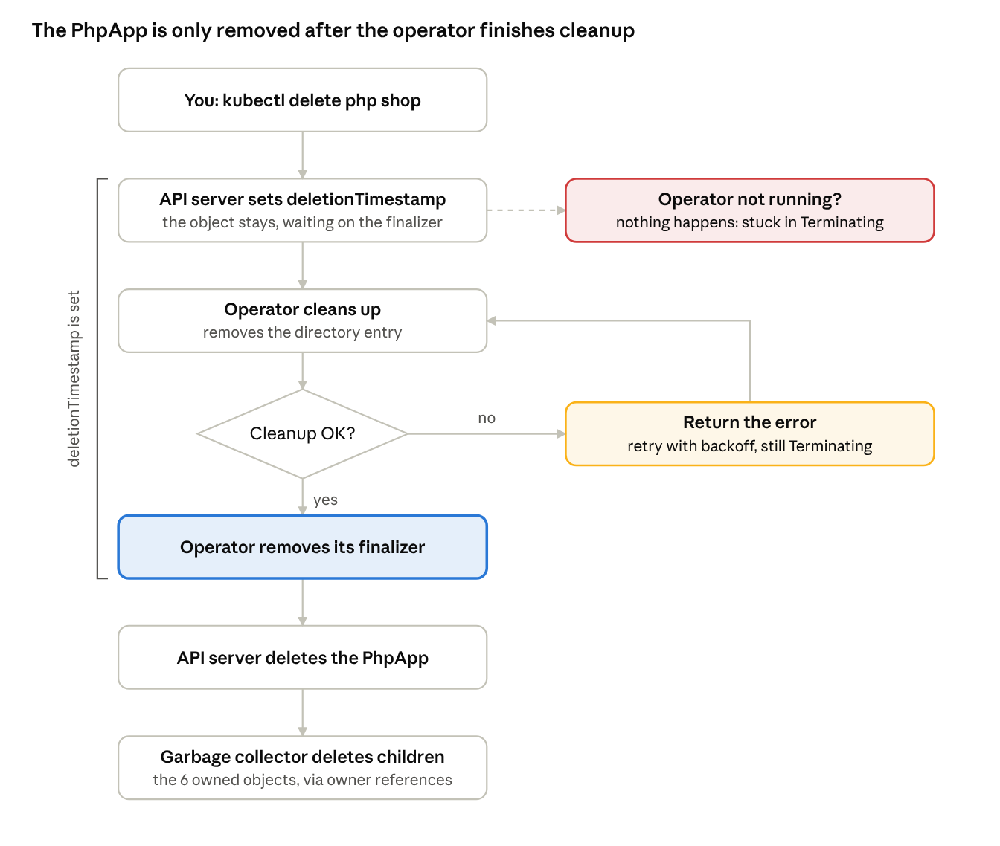
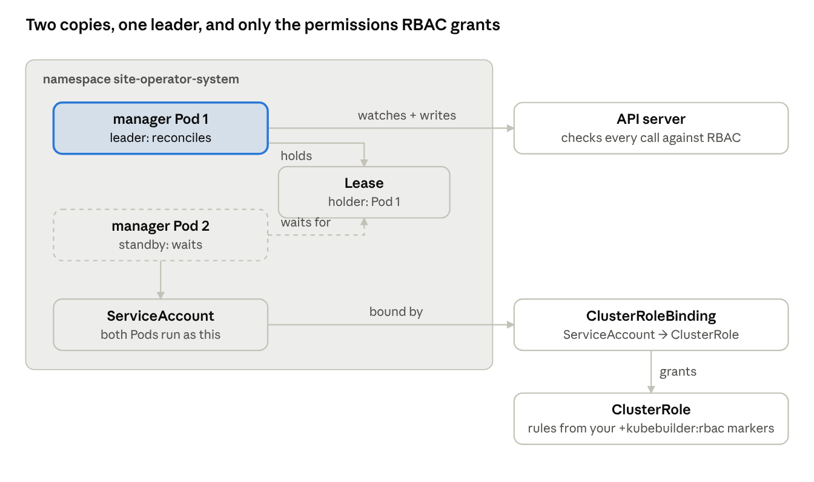

# Day 5 — Cleanup, rules, tests and shipping

[← Day 4](../day-4-phpapp/README.md) · [Day 6 →](../day-6-stateful-workloads/README.md)

> **Finished code:** the operator as it stands at the end of the week is in [`reference/site-operator`](../reference/site-operator/). Peek when you are stuck, not before.

Your operators work. Today you make them safe to hand to someone else. In the morning: a **finalizer** so PhpApp cleans up what owner references can't reach, and **validation** so bad input is rejected at the door. In the afternoon: **tests**, running the operator **inside the cluster** with its real permissions, and adding a **second API version** the way real operators upgrade.

## Today's plan

About 7 hours: the busiest day of the week. Parts 4 and 7 have optional extras you can skip if time runs short.

| Time | What you do |
| --- | --- |
| **Morning** |  |
| 0:15 | Big idea: last words and house rules |
| 0:50 | Part 1 — a finalizer for PhpApp |
| 0:30 | Part 2 — try it and break it |
| 0:40 | Part 3 — stricter validation |
| 0:25 | Part 4 — admission webhooks (concept, optional lab) |
| **Afternoon** |  |
| 0:15 | Big idea: from your laptop to the cluster |
| 1:00 | Part 5 — tests with envtest |
| 1:00 | Part 6 — run it in the cluster |
| 0:45 | Part 7 — a second API version and the upgrade order |
| 0:30 | Troubleshooting, check yourself, week wrap-up |

## Morning big idea: last words and house rules

**Last words.** Owner references clean up children automatically, but they have limits: an owner and its children must live in the same namespace, and they can't point outside Kubernetes at all. Think of a library card. When you move away, the library doesn't automatically know to cancel it; you have to go and do it before you leave. A **finalizer** is a note on an object that says "don't delete me yet, someone has a job to finish first."

**House rules.** On Day 2 your schema rejected `replicas: 20`. Real operators need richer rules: "this field can't change after creation," "don't use the `:latest` tag." Catching bad input at the front desk is far kinder than an operator failing halfway through.

| Tool | Picture it as | What it really is |
| --- | --- | --- |
| Finalizer | A "wait, I'm not finished" sticky note | A string in `metadata.finalizers`. While any are present, a delete only sets `deletionTimestamp` and nothing is removed. Pods and namespaces then show `Terminating`; custom resources look unchanged in `kubectl get`, so check `deletionTimestamp` |
| Schema rules (markers) | Boxes that only accept numbers 1–10 | OpenAPI validation in the CRD: types, min/max, patterns, enums |
| CEL rules | The desk clerk's checklist | Small expressions in the CRD (`x-kubernetes-validations`) the API server runs on every create and update |
| Admission webhook | Phoning the manager for approval | An HTTPS call from the API server to your operator, which can change or reject the object |

## Part 1 — A finalizer for PhpApp

### The job that needs one

Give the operator a small new duty: keep a **shop directory**, one ConfigMap listing every PhpApp in the cluster and its address, so other teams can find them. The directory lives in its own namespace, `directory`. Because it's in a different namespace from the PhpApps, an owner reference can't clean up its entries. When a PhpApp is deleted, the operator must remove that entry itself, before the PhpApp vanishes. That's exactly what finalizers are for.

(In real operators the "entry" is something like a cloud load balancer, a DNS record, a backup in object storage, or a database user. Same pattern, higher stakes.)

Create the namespace once:

```bash
kubectl create namespace directory
```

### The code

In `phpapp_controller.go`, add a name for the finalizer and two directory helpers:

```go
const (
	finalizerName = "web.example.com/directory-cleanup"
	directoryNS   = "directory"
	directoryName = "phpapps"
)

func directoryKey(app *webv1alpha1.PhpApp) string { return app.Namespace + "." + app.Name }

// addToDirectory writes (or refreshes) this app's entry.
func (r *PhpAppReconciler) addToDirectory(ctx context.Context, app *webv1alpha1.PhpApp) error {
	dir := &corev1.ConfigMap{ObjectMeta: metav1.ObjectMeta{Name: directoryName, Namespace: directoryNS}}
	_, err := controllerutil.CreateOrUpdate(ctx, r.Client, dir, func() error {
		if dir.Data == nil {
			dir.Data = map[string]string{}
		}
		dir.Data[directoryKey(app)] = fmt.Sprintf("http://%s.%s.svc", app.Name, app.Namespace)
		return nil
	})
	return err
}

// removeFromDirectory deletes this app's entry. Missing directory = nothing to do.
func (r *PhpAppReconciler) removeFromDirectory(ctx context.Context, app *webv1alpha1.PhpApp) error {
	var dir corev1.ConfigMap
	err := r.Get(ctx, types.NamespacedName{Namespace: directoryNS, Name: directoryName}, &dir)
	if apierrors.IsNotFound(err) {
		return nil
	}
	if err != nil {
		return err
	}
	delete(dir.Data, directoryKey(app))
	return r.Update(ctx, &dir)
}
```

Now put the finalizer logic at the **top** of `Reconcile`, right after the `r.Get` that reads the PhpApp (before `prev := ...`):

```go
	// Being deleted? Do the last job, then let go.
	if !app.DeletionTimestamp.IsZero() {
		if controllerutil.ContainsFinalizer(&app, finalizerName) {
			if err := r.removeFromDirectory(ctx, &app); err != nil {
				return ctrl.Result{}, err // retry; the PhpApp waits in Terminating
			}
			controllerutil.RemoveFinalizer(&app, finalizerName)
			if err := r.Update(ctx, &app); err != nil {
				return ctrl.Result{}, err
			}
		}
		return ctrl.Result{}, nil
	}

	// Alive: make sure our sticky note is on before we create anything outside.
	if controllerutil.AddFinalizer(&app, finalizerName) {
		if err := r.Update(ctx, &app); err != nil {
			return ctrl.Result{}, err
		}
	}
```

And add the directory entry just before the final `ready` report:

```go
	if err := r.addToDirectory(ctx, &app); err != nil {
		return ctrl.Result{}, err
	}
	return r.report(ctx, &app, prev, "ready", "AllReady", "nginx and php-fpm are ready")
```

### What happens on delete



Three rules every finalizer follows:

1. **Add the finalizer before creating the outside thing.** Otherwise a quick delete could slip through before the note is on, and the entry would be left behind forever.
2. **Cleanup must be safe to repeat.** If the operator crashes after cleaning up but before removing the finalizer, the next pass runs cleanup again. That's why `removeFromDirectory` treats "already gone" as success.
3. **Remove the finalizer only after cleanup succeeded.** If cleanup fails, return the error: the PhpApp stays in `Terminating` and the operator retries. Stuck-but-honest beats gone-but-leaking.

One more permission: the directory is a ConfigMap, which you already allowed on Day 4. If you'd chosen a different kind of object, you'd need a new RBAC marker. Run `make manifests generate install` and restart `make run`.

## Part 2 — Try it and break it

After restarting the operator, check the sticky note and the directory:

```bash
kubectl get php shop -o jsonpath='{.metadata.finalizers}{"\n"}'
kubectl get configmap phpapps -n directory -o yaml
```

You should see `["web.example.com/directory-cleanup"]` and an entry `default.shop: http://shop.default.svc`.

**Experiment 1: a clean delete.** In a second terminal, run `kubectl get php -w`, then:

```bash
kubectl delete php shop
kubectl get configmap phpapps -n directory -o yaml   # entry gone
```

The delete takes a moment longer than before. In the log you'll see the cleanup pass, then the PhpApp disappears and the garbage collector removes the six children. Re-apply `shop.yaml`.

**Experiment 2: stuck in Terminating.** Stop the operator (`Ctrl+C`), then:

```bash
kubectl delete php shop --wait=false
kubectl get php shop
kubectl get php shop -o jsonpath='{.metadata.deletionTimestamp}  {.metadata.finalizers}{"\n"}'
```

The PhpApp sits there, marked for deletion, waiting on a finalizer nobody is running. Note that `kubectl get php shop` looks completely normal: unlike Pods, custom resources don't show a `Terminating` status. The `deletionTimestamp` in the second command is how you tell. When people say a custom resource is "stuck in Terminating", this is what they mean. **This is the most common "stuck" ticket for any operator.** The fix is almost never to force anything: start the operator (`make run`) and watch it finish the job by itself.

**Experiment 3: removing a finalizer by hand (and why it hurts).** Re-apply `shop.yaml`, wait for `ready`, stop the operator, and delete again. This time, remove the note yourself:

```bash
kubectl delete php shop --wait=false
kubectl patch php shop --type=merge -p '{"metadata":{"finalizers":null}}'
kubectl get configmap phpapps -n directory -o yaml
```

The PhpApp is gone instantly, but its directory entry is **still there**, and nothing will ever clean it up. With a real operator, that leftover could be a load balancer still costing money or a database user nobody remembers. Before removing a finalizer by hand, always find out (1) which controller owns it, (2) why it isn't finishing, and (3) what cleanup you'll have to do yourself.

Restart the operator, re-apply `shop.yaml`, and tidy the leftover entry with `kubectl edit configmap phpapps -n directory`.

**Bonus: a namespace that won't die.** A namespace can't finish deleting until everything inside it is gone. So a namespace containing a PhpApp, deleted while the operator is down, sits in `Terminating` too. `kubectl get namespace <ns> -o yaml` shows conditions that name what's still blocking it.

## Part 3 — Stricter validation

The API server can enforce surprisingly rich rules for you, with no extra code running. You've used the simple markers since Day 2. **CEL** (Common Expression Language) rules go further: each one is a short expression that must be true, plus the message to show when it isn't.

Add these to `api/v1alpha1/phpapp_types.go`:

```go
type ComponentSpec struct {
	// +kubebuilder:validation:XValidation:rule="!self.endsWith(':latest')",message="pin a version; the :latest tag is not allowed"
	// +optional
	Image string `json:"image,omitempty"`
	// ...Replicas unchanged...
}

type PhpAppSpec struct {
	// Code is the content of index.php.
	// +kubebuilder:validation:MinLength=1
	// +kubebuilder:validation:XValidation:rule="self.contains('<?php')",message="code must contain an opening <?php tag"
	Code string `json:"code"`

	// SecretName names a Secret whose keys become env vars for PHP.
	// +kubebuilder:validation:MinLength=1
	// +kubebuilder:validation:XValidation:rule="self == oldSelf",message="secretName cannot be changed; create a new PhpApp instead"
	SecretName string `json:"secretName"`
	// ...Php and Nginx unchanged...
}
```

`make manifests install`, then test each rule:

```bash
kubectl patch php shop --type=merge -p '{"spec":{"php":{"image":"php:latest"}}}'
kubectl patch php shop --type=merge -p '{"spec":{"code":"hello"}}'
kubectl patch php shop --type=merge -p '{"spec":{"secretName":"other"}}'
```

All three are rejected with your messages. The third is a **transition rule**: `oldSelf` is the value before the change, so the rule only runs on updates and makes the field immutable. Find your rules in the generated CRD under `x-kubernetes-validations`. Support tip: when a customer quotes an odd validation message, search the operator's CRD for it to find the rule that produced it.

### Which tool for which rule

| Rule | Best tool |
| --- | --- |
| Type, range, length, pattern, list of allowed values | Schema markers (`Minimum`, `Pattern`, `Enum`, …) |
| Rules that compare fields, or old value vs new value | CEL (`XValidation`) |
| Rules that need to look at *other* objects ("does this Secret exist?") | Not validation at all: check in Reconcile and report in status (Day 4), or use a webhook |
| Filling in values that depend on logic | A defaulting webhook, or defaults in code (Day 4) |

## Part 4 — Admission webhooks

Sometimes rules need real code. An **admission webhook** is your operator acting as the desk clerk's manager: before saving an object, the API server sends it over HTTPS to your operator and waits for an answer. A **mutating** webhook can change the object (fill in defaults); a **validating** webhook can only say yes or no.

Kubebuilder can scaffold one for you:

```bash
kubebuilder create webhook --group web --version v1alpha1 --kind PhpApp --defaulting --programmatic-validation
```

This creates `Default()` and `ValidateCreate/Update/Delete()` methods for you to fill in, plus the YAML that registers the webhook with the API server. Webhooks need TLS certificates, which is why Kubebuilder's setup uses **cert-manager**. That's why this lab is optional today: it's worth doing once you have cert-manager installed in your kind cluster.

What matters most for support is **how webhooks fail**, because it surprises people:

- The API server **calls out** to the webhook on every matching create or update. If the operator Pod is down, that call fails.
- With `failurePolicy: Fail` (the usual setting for validation), a failing call means **the API server rejects the request**. Users see errors like `failed calling webhook "...": ... connection refused` or `context deadline exceeded`, even for changes that have nothing wrong with them.
- The webhook's own Service, endpoints and certificate all have to be healthy. An expired or wrongly issued certificate shows up as `x509: certificate ...` errors.

So when "I can't create or edit anything of kind X" lands on your desk, check `kubectl get validatingwebhookconfigurations,mutatingwebhookconfigurations` for a webhook covering that kind, then check that its Service has ready endpoints.

## Afternoon big idea: from your laptop to the cluster

All week, `make run` ran your operator on your laptop using **your** admin login. That hid three things real users will hit:

1. **Nobody checked your work automatically.** Tests catch broken logic before anyone else sees it.
2. **The operator had your permissions, not its own.** In the cluster it runs as a ServiceAccount with exactly the permissions in `config/rbac/`. A missing marker that never mattered on your laptop now means `forbidden`.
3. **There was only ever one copy.** In production you may run two copies for safety, and they must not both act at once.

This afternoon fixes all three, then looks at the hardest part of an operator's life: changing its API without breaking anyone.

## Part 5 — Tests with envtest

**envtest** starts a real API server and etcd on your laptop, just for the tests, with your CRDs installed. What it doesn't start is any controller or kubelet: no Deployment controller, no Pods ever run. That sounds like a weakness, but it's actually useful. It lets you test exactly what *your* code does, and it naturally tests your gates: in envtest, php-fpm never becomes ready, so nginx should never be built.

Kubebuilder already scaffolded `internal/controller/suite_test.go` (starts envtest) and `internal/controller/phpapp_controller_test.go` (an example test using **Ginkgo** and **Gomega**, which read almost like English). Replace the example `It(...)` block in `phpapp_controller_test.go` with two tests of your own. Also delete the scaffolded BeforeEach and AfterEach: their sample PhpApp has no code, so your new validation would reject it.

**Fix the other scaffolded tests too.** `make test` runs every `_test.go` file in the package. The scaffolded StaticSite test creates its reconciler without a `Recorder`, so it crashes as soon as an event is written, and its sample object has an empty spec that your validation now rejects. Give it the same treatment, or copy the finished test files from [`reference/site-operator`](../reference/site-operator/).

```go
It("builds the kitchen but waits before the front counter", func() {
	ctx := context.Background()

	By("creating a Secret and a PhpApp")
	Expect(k8sClient.Create(ctx, &corev1.Secret{
		ObjectMeta: metav1.ObjectMeta{Name: "t1-secrets", Namespace: "default"},
		StringData: map[string]string{"GREETING": "hi"},
	})).To(Succeed())
	app := &webv1alpha1.PhpApp{
		ObjectMeta: metav1.ObjectMeta{Name: "t1", Namespace: "default"},
		Spec: webv1alpha1.PhpAppSpec{
			Code: "<?php echo 1;", SecretName: "t1-secrets",
			Php: webv1alpha1.ComponentSpec{Replicas: 1}, Nginx: webv1alpha1.ComponentSpec{Replicas: 1},
		},
	}
	Expect(k8sClient.Create(ctx, app)).To(Succeed())

	By("running one Reconcile pass")
	r := &PhpAppReconciler{Client: k8sClient, Scheme: k8sClient.Scheme(), Recorder: events.NewFakeRecorder(100)}
	key := types.NamespacedName{Name: "t1", Namespace: "default"}
	_, err := r.Reconcile(ctx, reconcile.Request{NamespacedName: key})
	Expect(err).NotTo(HaveOccurred())

	By("finding the php Deployment, owned by the PhpApp")
	var php appsv1.Deployment
	Expect(k8sClient.Get(ctx, types.NamespacedName{Name: "t1-php", Namespace: "default"}, &php)).To(Succeed())
	Expect(php.OwnerReferences).To(HaveLen(1))
	Expect(php.OwnerReferences[0].Kind).To(Equal("PhpApp"))

	By("not building nginx yet, because no php Pod is ready")
	var nginx appsv1.Deployment
	err = k8sClient.Get(ctx, types.NamespacedName{Name: "t1-nginx", Namespace: "default"}, &nginx)
	Expect(apierrors.IsNotFound(err)).To(BeTrue())

	By("reporting initializing, with our finalizer on")
	Expect(k8sClient.Get(ctx, key, app)).To(Succeed())
	Expect(app.Status.State).To(Equal("initializing"))
	Expect(app.Finalizers).To(ContainElement(finalizerName))
})

It("reports a missing Secret instead of failing", func() {
	ctx := context.Background()
	app := &webv1alpha1.PhpApp{
		ObjectMeta: metav1.ObjectMeta{Name: "t2", Namespace: "default"},
		Spec: webv1alpha1.PhpAppSpec{Code: "<?php echo 2;", SecretName: "nope"},
	}
	Expect(k8sClient.Create(ctx, app)).To(Succeed())

	r := &PhpAppReconciler{Client: k8sClient, Scheme: k8sClient.Scheme(), Recorder: events.NewFakeRecorder(100)}
	key := types.NamespacedName{Name: "t2", Namespace: "default"}
	_, err := r.Reconcile(ctx, reconcile.Request{NamespacedName: key})
	Expect(err).NotTo(HaveOccurred()) // waiting is not an error

	Expect(k8sClient.Get(ctx, key, app)).To(Succeed())
	Expect(app.Status.State).To(Equal("error"))
	Expect(meta.IsStatusConditionFalse(app.Status.Conditions, "SecretFound")).To(BeTrue())
})
```

Add any missing imports to the test file (`corev1`, `appsv1`, `apierrors`, `meta`, `metav1`, `types`, `"k8s.io/client-go/tools/events"`, `reconcile`), then:

```bash
make test
```

The first run downloads the envtest binaries, so it takes a while. Look for both test names passing. Then **prove the tests can catch a bug**: comment out Gate 2 in `Reconcile` and run `make test` again. The first test should now fail, because nginx gets built. Put Gate 2 back.

What these tests guard: ownership, gates, status and finalizers, the exact things that cause support tickets when they break.

## Part 6 — Run it in the cluster

### Build, load and deploy

Stop `make run` first. Two copies of the operator acting at once would fight over the same objects.

```bash
make docker-build IMG=site-operator:dev
kind load docker-image site-operator:dev --name ops-lab
make deploy IMG=site-operator:dev
```

`kind load` copies your image straight into the kind node, so no registry is needed. On k3d, the equivalent is `k3d image import site-operator:dev -c <cluster-name>`. Use a real tag like `:dev`, not `:latest`. With `:latest`, Kubernetes always tries to pull the image from a registry and fails to find your local one.

`make deploy` applies everything in `config/`: the CRDs, a namespace `site-operator-system`, a ServiceAccount, the RBAC roles generated from your markers, and the Deployment `site-operator-controller-manager`. Check it:

```bash
kubectl get pods -n site-operator-system
kubectl logs -n site-operator-system deploy/site-operator-controller-manager -f
```

Your StaticSite and PhpApp keep working: the operator is the same program, it just lives somewhere else now.

### What's different in the cluster



**Experiment 1: it has *its own* permissions.** Ask Kubernetes what the operator is allowed to do:

```bash
SA=system:serviceaccount:site-operator-system:site-operator-controller-manager
kubectl auth can-i list secrets --as=$SA
kubectl auth can-i delete secrets --as=$SA
kubectl auth can-i create deployments --as=$SA -n default
```

`yes`, `no`, `yes`, exactly as your markers said (read-only Secrets: least privilege, from Day 4). Now break it: delete the `secrets` RBAC marker, then `make manifests` and `make deploy IMG=site-operator:dev`. The log fills with errors like `secrets is forbidden: User "system:serviceaccount:..." cannot list resource "secrets"`, and PhpApps stop progressing. This is the error you never saw with `make run`. Put the marker back and redeploy.

**Experiment 2: two copies, one boss.** Scale the operator to 2:

```bash
kubectl scale deploy site-operator-controller-manager -n site-operator-system --replicas=2
kubectl get lease -n site-operator-system
```

Only one copy does any work. The **Lease** object names the current leader (look at `spec.holderIdentity`). The other copy waits; its log says it's trying to acquire the lease. Delete the leader Pod and watch the standby take over within seconds. This is **leader election**, switched on by the `--leader-elect` flag Kubebuilder puts in the manager's Deployment. That flag was off with `make run`.

**Experiment 3: the operator is a Pod like any other.** Everything from Day 1 applies to it: `kubectl describe pod`, events, restarts, `CrashLoopBackOff`, resource limits in `config/manager/manager.yaml`. When an operator "does nothing," check first that its Pod is running and that one copy holds the lease.

## Part 7 — A second API version and the upgrade order

`v1alpha1` means "still changing." One day PhpApp graduates to `v1beta1`, but every existing PhpApp was saved as `v1alpha1`, and users' YAML files say `v1alpha1` too. A CRD can **serve** several versions at once, while **storing** objects in exactly one of them.

### Add v1beta1 (same shape)

```bash
kubebuilder create api --group web --version v1beta1 --kind PhpApp
```

Answer `y` to *Create Resource* and **`n`** to *Create Controller*: one controller is enough. Copy the spec and status types from `v1alpha1` into `api/v1beta1/phpapp_types.go` unchanged, and add one marker above `type PhpApp struct` in **v1beta1**:

```go
// +kubebuilder:storageversion
```

Then `make manifests generate`, and `make deploy IMG=site-operator:dev` again (it reapplies the CRD). Both versions now work:

```bash
kubectl get phpapps.v1alpha1.web.example.com
kubectl get phpapps.v1beta1.web.example.com
kubectl get crd phpapps.web.example.com -o jsonpath='{.status.storedVersions}{"\n"}'
```

`storedVersions` lists every version objects might still be saved in: `["v1alpha1","v1beta1"]`. Old objects stay stored as `v1alpha1` until something rewrites them. That's why you can't simply delete an old version from a CRD. Objects stored in it would become unreadable, and the API server refuses to drop a version still listed in `storedVersions`.

Because both versions have the same shape, the API server converts between them by just changing the `apiVersion` line. **If a field were renamed** (say, `secretName` → `secretRef.name`), it couldn't. You'd need a **conversion webhook**: code in your operator that translates between versions, with all the webhook failure modes from Part 4. That's why operator authors rename fields very reluctantly.

### The upgrade order

When a new operator release changes the CRD, the order of steps matters:

1. **CRDs first.** The new operator may read and write new fields. With an old CRD, those fields get pruned (Day 2), and the operator behaves strangely.
2. **RBAC next.** New features often need new permissions (Experiment 1 in Part 6).
3. **The operator Deployment.** It restarts, takes the lease and reconciles everything, which may roll Pods if generated config changed (Day 4, Part 4).
4. **Custom resources last.** Only now start using new fields or the new `apiVersion`.

Release notes for real operators spell out this order. When an upgrade goes wrong, the first question is which of these steps was skipped. A quick check:

```bash
kubectl get crd phpapps.web.example.com -o jsonpath='{.spec.versions[*].name}{"\n"}'
kubectl get deploy -n site-operator-system site-operator-controller-manager -o jsonpath='{.spec.template.spec.containers[0].image}{"\n"}'
```

The CRD's versions and the operator's image should come from the same release.

## Troubleshooting corner

| What you see | Where to look | Usual cause |
| --- | --- | --- |
| Custom resource stuck in `Terminating` | `metadata.finalizers`, `metadata.deletionTimestamp`, operator Pod and logs | Operator down, or its cleanup keeps failing. Fix the operator; remove finalizers by hand only as a last resort, and do the cleanup yourself |
| Namespace stuck in `Terminating` | `kubectl get ns <ns> -o yaml` → `status.conditions` | Objects inside still have finalizers (often a custom resource whose operator is gone) |
| `... is forbidden: User "system:serviceaccount:..." cannot ...` | `kubectl auth can-i ... --as=system:serviceaccount:<ns>:<sa>` | Missing RBAC rule; the generated role doesn't match what the code does |
| `failed calling webhook ... connection refused` / `context deadline exceeded` | `kubectl get validatingwebhookconfigurations,mutatingwebhookconfigurations`, the webhook Service's endpoints | The operator Pod serving the webhook is down or unreachable |
| `x509: certificate ...` on create or update | cert-manager Certificate, webhook `caBundle` | Webhook certificate expired or not injected |
| `ErrImagePull` for the operator itself on kind | Image tag | `:latest` makes Kubernetes pull from a registry; use a fixed tag and `kind load` |
| Two operator copies fighting (constant `updated`, conflicts) | `kubectl get lease -n <ns>`, other running copies (e.g. a forgotten `make run`) | Leader election off, or a second copy running outside the cluster |
| Validation message you don't recognise | Search the CRD YAML for the message text | A CEL rule (`x-kubernetes-validations`) or schema limit |
| After an upgrade, fields disappear or operator errors on decode | CRD versions vs operator image | CRDs not upgraded first |
| `make test` fails with "unable to start control plane" | envtest binaries | Run `make setup-envtest` or check `KUBEBUILDER_ASSETS` |

## Check yourself

1. Why couldn't an owner reference clean up the directory entry?
2. Why must the finalizer be added *before* the operator creates anything outside?
3. A custom resource has been `Terminating` for an hour. What do you check, in what order?
4. What can go wrong if you remove a finalizer by hand?
5. Name one rule each for schema markers, CEL, and Reconcile-plus-status.
6. Why can a broken webhook stop people from editing objects that are perfectly fine?
7. Why didn't you see `forbidden` errors all week until Part 6?
8. Two operator Pods are running. How do you know which one is working?
9. Why can't you just delete `v1alpha1` from the CRD once `v1beta1` exists?
10. What's the safe upgrade order, and why do CRDs go first?

**Answers**

1. Owner references only work within one namespace (and only inside Kubernetes). The directory lives in another namespace.
2. If the object were deleted between creating the outside thing and adding the note, nothing would ever clean it up.
3. `metadata.finalizers` (which controller is it waiting for?), then that operator's Pod (running? holding the lease?), then its logs (what error is the cleanup hitting?).
4. Whatever the cleanup was meant to remove is left behind for good: a leaked entry, cloud resource, or database user. Nothing will ever retry it.
5. For example: markers for `replicas` between 1 and 10; CEL for "`secretName` can't change" or "no `:latest`"; Reconcile-plus-status for "the Secret must exist."
6. The API server calls the webhook on every matching create or update. With `failurePolicy: Fail`, a call that can't get through means the request is rejected, whatever the object contains.
7. `make run` used your admin kubeconfig. In the cluster the operator uses its ServiceAccount, limited to the generated RBAC.
8. `kubectl get lease -n <namespace>`: `holderIdentity` names the leader; the other copy is on standby.
9. Objects may still be stored as `v1alpha1` (see `status.storedVersions`). Removing it would make them unreadable, so the API server won't allow it until they're migrated.
10. CRDs → RBAC → operator → custom resources. CRDs go first so that the new operator's fields aren't pruned or rejected by an old schema.

## Week wrap-up

In five days you went from three hand-written YAML files to two operators with status, events, gates, finalizers, validation, tests, least-privilege RBAC, leader election and a versioned API. Every one of those pieces exists in production operators, including database operators. They're just bigger.

### A checklist for troubleshooting any operator

Work top to bottom. Each step uses a skill from this week:

1. **Is the API what the operator expects?** CRD installed, versions match the operator's release (`kubectl get crd`, operator image tag). *Days 2, 5*
2. **What does the custom resource say?** `kubectl get <kind>` columns, then `status`: state, conditions with reasons, `observedGeneration` vs `generation`. *Day 3*
3. **What happened recently?** `kubectl describe <kind> <name>` for events; `kubectl get events --sort-by=.lastTimestamp`. *Days 1, 3*
4. **Is the operator alive and in charge?** Operator Pod running, not crash-looping, one copy holding the Lease. *Day 5*
5. **What does the operator say?** Its logs: find the *first* error, not the hundredth retry. *Days 2, 4*
6. **Can it do its job?** `kubectl auth can-i` as its ServiceAccount; webhooks healthy. *Day 5*
7. **Are the children healthy?** Owned Deployments/StatefulSets, Services and their endpoints, ConfigMaps, Secrets it depends on; then Pods and container logs. *Days 1, 4*
8. **Is something stuck deleting?** Finalizers and `deletionTimestamp`; which controller owns the finalizer. *Day 5*
9. **Did someone fight the operator?** Hand edits to owned objects get reverted; the fix belongs in the custom resource. *Days 2, 3*

### Clean up

```bash
kubectl delete php,site,kv,kvbackup --all -A   # first, while the operator can still run its finalizers
make undeploy                       # then remove the operator, its RBAC and the CRDs
kind delete cluster --name ops-lab  # when you're done with the playground
```

The order is one last lesson: run `make undeploy` first and the operator disappears while PhpApps still carry its finalizer. They (and the CRD deletion waiting on them) get stuck in `Terminating`, which is exactly Part 2's Experiment 2 at cluster scale.

### What's next

**Day 6** moves to **stateful** workloads: StatefulSets, PersistentVolumeClaims, a primary with replicas, and backups. If you already deleted the kind cluster, Day 6's setup recreates it. After that comes reading a real database operator's source with this week's map in hand: find its CRDs, its `Reconcile`, its gates, its status conditions and its finalizers.

---

[← Day 4](../day-4-phpapp/README.md) · [Day 6 →](../day-6-stateful-workloads/README.md)
