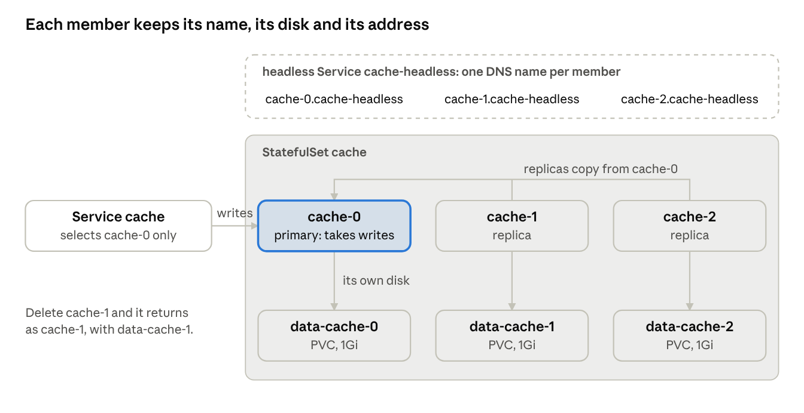
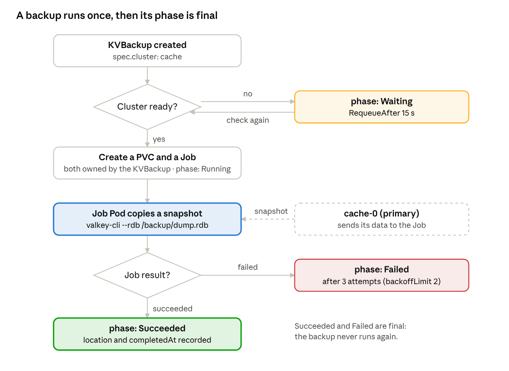

# Day 6 — Stateful workloads: an operator for a small database

[← Day 5](../day-5-cleanup-tests-shipping/README.md) · [Reference code →](../reference/site-operator/README.md)

> **Lab files:** every YAML file in this lesson is ready-made in [`labs/day6/`](../labs/day6/): [`kv.yaml`](../labs/day6/kv.yaml), [`cache.yaml`](../labs/day6/cache.yaml), [`backup.yaml`](../labs/day6/backup.yaml), [`broken.yaml`](../labs/day6/broken.yaml). Type them yourself the first time; use these to check your work.

> **Finished code:** the operator as it stands at the end of the week is in [`reference/site-operator`](../reference/site-operator/). Peek when you are stuck, not before.

nginx and PHP forget everything when a Pod restarts, which is why Deployments were enough. A database can't forget. Today you meet **StatefulSets** and **PersistentVolumeClaims**, then build a third operator, **KVCluster**, that runs a small replicated key-value database ([Valkey](https://valkey.io/), the open-source fork of Redis). These are the patterns every database operator is built on: stable names, one disk per Pod, a primary and its replicas, careful updates, and backups.

## Today's plan

About 7 hours. You'll add KVCluster and KVBackup to the same `site-operator` project.

| Time | What you do |
| --- | --- |
| 0:20 | Big idea: name tags and lockers |
| 0:50 | Part 1 — a StatefulSet by hand |
| 0:40 | Part 2 — replication by hand |
| 0:30 | Part 3 — design the KVCluster API |
| 1:15 | Part 4 — write Reconcile |
| 0:45 | Part 5 — what a StatefulSet won't do for you |
| 0:50 | Part 6 — backups |
| 0:50 | Part 7 — run it and break it, troubleshooting, check yourself |

**If Day 5's clean-up removed everything**, rebuild the playground first:

```bash
kind create cluster --name ops-lab
cd site-operator
make install          # CRDs back into the cluster
make run              # run the operator from your laptop again for today
```

Then look at the storage your cluster offers:

```bash
kubectl get storageclass
```

kind comes with one StorageClass called `standard`, marked `(default)`. On k3d or k3s it's called `local-path`. Either way it creates disks as folders on the node (the "local-path" provisioner). It's perfect for learning, with two limits you'll meet today: the disks live on one node, and they can't be resized.

## Big idea: name tags and lockers

Pods from a Deployment are like identical paper cups: random names, interchangeable, throw one away and grab another. That's fine for nginx. A database member is more like a **student with a name tag and a locker**. `cache-0` is always `cache-0`. It always gets the same locker (its disk) back, and the others know how to find it by name. If it goes home sick and comes back, it's still `cache-0`, with its own books still in its locker.

That's what a **StatefulSet** gives you that a Deployment doesn't:



| Piece | Picture it as | What it really is |
| --- | --- | --- |
| StatefulSet | A class register with numbered seats | A controller that creates Pods named `<name>-0`, `<name>-1`, … in order, and replaces each one with the same name |
| Ordinal | The seat number | The number at the end of the Pod name. Stays the same across restarts |
| PersistentVolumeClaim (PVC) | A request for a locker | A request for storage of a given size; one per Pod, named `data-cache-0`, `data-cache-1`, … |
| PersistentVolume (PV) | The actual locker | The real disk (here, a folder on the kind node) bound to a PVC |
| StorageClass | The locker supplier | Says how to create PVs on demand, and whether they can grow |
| `volumeClaimTemplates` | The locker request form | The PVC template in the StatefulSet; one PVC is created from it per Pod |
| Headless Service | The register with everyone's direct phone number | A Service with `clusterIP: None`: no shared address, just one DNS name per Pod, like `cache-0.cache-headless` |

Two more promises matter for databases:

- **Order.** By default `cache-1` isn't created until `cache-0` is running and ready, and scale-down removes the highest number first. That's what lets `cache-0` be the one that starts first and sets things up.
- **At most one.** There is never more than one `cache-0` at a time. Kubernetes would rather leave a member down than risk two copies writing the same disk. Hold on to this one: it explains the scariest stuck-Pod situations.

## Part 1 — A StatefulSet by hand

As on Day 1, do it by hand first so you know exactly what the operator will automate. Save as `kv.yaml`:

```yaml
apiVersion: v1
kind: Service
metadata:
  name: kv-headless
spec:
  clusterIP: None                  # headless: one DNS name per Pod, no shared address
  publishNotReadyAddresses: true   # members can find each other before they're Ready
  selector:
    app: kv
  ports:
  - name: valkey
    port: 6379
---
apiVersion: apps/v1
kind: StatefulSet
metadata:
  name: kv
spec:
  serviceName: kv-headless         # gives Pods names like kv-0.kv-headless
  replicas: 3
  selector:
    matchLabels:
      app: kv
  template:
    metadata:
      labels:
        app: kv
    spec:
      containers:
      - name: valkey
        image: valkey/valkey:8.0
        args: ["valkey-server", "--appendonly", "yes", "--dir", "/data"]
        ports:
        - containerPort: 6379
        volumeMounts:
        - name: data
          mountPath: /data         # Valkey saves its data here
  volumeClaimTemplates:            # one locker request per Pod
  - metadata:
      name: data
    spec:
      accessModes: ["ReadWriteOnce"]
      resources:
        requests:
          storage: 1Gi
```

`--appendonly yes` makes Valkey write every change to a file in `/data`, so the data survives restarts.

**Experiment 1: in order, one at a time.** Watch in one terminal, apply in the other:

```bash
kubectl get pods,pvc -l app=kv -w
kubectl apply -f kv.yaml
```

`kv-0` appears and becomes Ready *before* `kv-1` is even created, then `kv-2`. Three PVCs appear too: `data-kv-0`, `data-kv-1`, `data-kv-2`, each `Bound`. The PVC name is always `<template name>-<StatefulSet name>-<ordinal>`. Memorise that pattern; you'll use it to find any member's disk.

**Experiment 2: direct phone numbers.**

```bash
kubectl exec kv-2 -- getent hosts kv-1.kv-headless
```

Each member has its own DNS name that always points at that member, whatever its IP is today. (The Valkey image has no `nslookup`, but `getent` asks the same resolver every program uses.)

**Experiment 3: the locker survives.**

```bash
kubectl exec kv-0 -- valkey-cli SET greeting "hello from kv-0"
kubectl delete pod kv-0
kubectl get pods -l app=kv -w        # kv-0 comes back: same name
kubectl exec kv-0 -- valkey-cli GET greeting
```

Still `hello from kv-0`. The new Pod got the same PVC, so the data was waiting for it. With a Deployment you'd get a random new name and an empty disk.

**Experiment 4: data outlives the app.**

```bash
kubectl scale statefulset kv --replicas=1     # kv-2 goes first, then kv-1
kubectl get pvc -l app=kv                     # all three PVCs are still there
kubectl scale statefulset kv --replicas=3     # kv-1 and kv-2 get their old lockers back
```

By default, **neither scaling down nor deleting a StatefulSet deletes its PVCs.** Kubernetes would rather leave a disk behind than throw data away. Keep that in mind: it's both a safety net and the reason old data mysteriously "comes back" when someone recreates a cluster with the same name.

## Part 2 — Replication by hand

Right now the three members are strangers, each with its own data. A real database cluster has **one primary** that takes writes and **replicas** that copy everything from it. Stable names make the plan simple: **`kv-0` is the primary; every other member copies from `kv-0.kv-headless`.**

Each Pod works out its own seat number from its hostname. Replace the `args:` line in `kv.yaml` with:

```yaml
        command: ["sh", "-c"]
        args:
        - |
          ORDINAL=${HOSTNAME##*-}            # "kv-2" -> "2"
          if [ "$ORDINAL" = "0" ]; then
            exec valkey-server --appendonly yes --dir /data
          fi
          exec valkey-server --appendonly yes --dir /data --replicaof kv-0.kv-headless 6379
```

Apply it and watch the **rolling update**: the StatefulSet replaces `kv-2` first, then `kv-1`, then `kv-0`, from the highest number down, one at a time. For us that's a lucky order: the replicas are updated before the primary.

**Check the replication:**

```bash
kubectl exec kv-0 -- valkey-cli INFO replication     # role and connected replicas
kubectl exec kv-0 -- valkey-cli SET color blue
kubectl exec kv-2 -- valkey-cli GET color            # "blue": copied over
kubectl exec kv-2 -- valkey-cli SET color red        # error: READONLY
```

The replica refuses writes. A client must always talk to the primary for writes, which is why the operator will give the primary its own Service.

**Now take the primary away:**

```bash
kubectl delete pod kv-0
kubectl exec kv-1 -- valkey-cli INFO replication     # link to the primary is down
```

For a few seconds there is **no primary**: writes have nowhere to go. Then `kv-0` comes back with the same name and the same disk, and a few seconds later the replicas reconnect by themselves. That's a restart, not a **failover**. Nobody promoted a replica. You'll come back to this in Part 5.

Why `publishNotReadyAddresses: true`? A replica isn't Ready until it has synced, but it needs DNS for `kv-0` *in order to* sync. Without this setting, members that aren't Ready yet have no DNS entry, so a cluster starting from scratch can trap itself.

Clean up the hand-made version before the operator takes over: `kubectl delete -f kv.yaml`, then `kubectl delete pvc -l app=kv` (remember, the PVCs stay behind otherwise).

## Part 3 — Design the KVCluster API

What should a user have to say? How many members, how big each disk is, and (optionally) which image and StorageClass. Everything you typed in Parts 1–2 (the script, the Services, the DNS names) is the operator's job.

```yaml
apiVersion: web.example.com/v1alpha1
kind: KVCluster
metadata:
  name: cache
spec:
  replicas: 3        # 1 primary + 2 replicas
  storage: 1Gi       # disk per member
```

Scaffold it:

```bash
kubebuilder create api --group web --version v1alpha1 --kind KVCluster
```

Then in `api/v1alpha1/kvcluster_types.go` (import `"k8s.io/apimachinery/pkg/api/resource"`):

```go
type KVClusterSpec struct {
	// Replicas is the number of members: one primary, the rest replicas.
	// +kubebuilder:validation:Minimum=1
	// +kubebuilder:validation:Maximum=7
	// +kubebuilder:default=3
	// +optional
	Replicas int32 `json:"replicas,omitempty"`

	// Storage is the disk size for each member. It can grow but never shrink.
	// +kubebuilder:default="1Gi"
	// +kubebuilder:validation:XValidation:rule="quantity(string(self)).compareTo(quantity(string(oldSelf))) >= 0",message="storage can only grow"
	// +optional
	Storage resource.Quantity `json:"storage,omitempty"`

	// StorageClassName picks the disk type. Empty means the cluster default.
	// Fixed at creation time.
	// +kubebuilder:validation:XValidation:rule="self == oldSelf",message="storageClassName cannot be changed"
	// +optional
	StorageClassName *string `json:"storageClassName,omitempty"`

	// +optional
	Image string `json:"image,omitempty"`
}

type KVClusterStatus struct {
	// +optional
	State string `json:"state,omitempty"`
	// +optional
	ReadyReplicas int32 `json:"readyReplicas,omitempty"`
	// Primary is the Pod currently taking writes.
	// +optional
	Primary string `json:"primary,omitempty"`
	// +optional
	ObservedGeneration int64 `json:"observedGeneration,omitempty"`
	// +listType=map
	// +listMapKey=type
	// +optional
	Conditions []metav1.Condition `json:"conditions,omitempty"`
}
```

And above `type KVCluster struct`:

```go
// +kubebuilder:subresource:status
// +kubebuilder:resource:shortName=kv
// +kubebuilder:printcolumn:name="State",type=string,JSONPath=`.status.state`
// +kubebuilder:printcolumn:name="Ready",type=integer,JSONPath=`.status.readyReplicas`
// +kubebuilder:printcolumn:name="Primary",type=string,JSONPath=`.status.primary`
// +kubebuilder:printcolumn:name="Age",type=date,JSONPath=`.metadata.creationTimestamp`
```

Three design choices to notice:

- **`resource.Quantity`** is Kubernetes' type for sizes like `1Gi` or `500Mi`. It's the same type Pods use for memory.
- **"Storage can only grow"** is a CEL rule (Day 5) using the `quantity()` helper, available in recent Kubernetes versions. Shrinking a disk isn't something Kubernetes can do, so the API refuses it up front.
- **`status.primary`** looks pointless while the primary is always member 0. It's there because real clusters fail over (Part 5), and the most useful thing a status can tell you during an incident is *who is primary right now*.

`make manifests generate install`.

## Part 4 — Write Reconcile

The operator builds three things: a headless Service (direct numbers), a client Service that points at the primary only, and the StatefulSet. All of it goes in `internal/controller/kvcluster_controller.go`. Add `Recorder events.EventRecorder` to the struct and wire it in `cmd/main.go` with `mgr.GetEventRecorder("kvcluster-controller")`, as on Day 3.

### Permissions

```go
// +kubebuilder:rbac:groups=apps,resources=statefulsets,verbs=get;list;watch;create;update;patch;delete
// +kubebuilder:rbac:groups="",resources=services,verbs=get;list;watch;create;update;patch;delete
// +kubebuilder:rbac:groups="",resources=persistentvolumeclaims,verbs=get;list;watch;update;patch
// +kubebuilder:rbac:groups=batch,resources=jobs,verbs=get;list;watch;create;update;patch;delete
// +kubebuilder:rbac:groups=events.k8s.io,resources=events,verbs=create;patch
```

Notice there's no `delete` on PVCs. The operator can grow disks but can't throw data away. (Jobs are for Part 6.)

### The start-up script, generated

```go
const defaultKVImage = "valkey/valkey:8.0"

func headlessName(c *webv1alpha1.KVCluster) string { return c.Name + "-headless" }
func primaryName(c *webv1alpha1.KVCluster) string  { return c.Name + "-0" }

// startScript: member 0 is the primary; everyone else copies from it.
func startScript(c *webv1alpha1.KVCluster) string {
	return fmt.Sprintf(`ORDINAL=${HOSTNAME##*-}
if [ "$ORDINAL" = "0" ]; then
  exec valkey-server --appendonly yes --dir /data
fi
exec valkey-server --appendonly yes --dir /data --replicaof %s.%s 6379
`, primaryName(c), headlessName(c))
}
```

### Reconcile

```go
func (r *KVClusterReconciler) Reconcile(ctx context.Context, req ctrl.Request) (ctrl.Result, error) {
	var c webv1alpha1.KVCluster
	if err := r.Get(ctx, req.NamespacedName, &c); err != nil {
		return ctrl.Result{}, client.IgnoreNotFound(err)
	}
	prev := c.Status.State
	labels := map[string]string{"app": c.Name, "component": "kv"}

	// 1. Direct phone numbers: the headless Service.
	headless := &corev1.Service{ObjectMeta: metav1.ObjectMeta{Name: headlessName(&c), Namespace: c.Namespace}}
	if _, err := controllerutil.CreateOrUpdate(ctx, r.Client, headless, func() error {
		headless.Spec.ClusterIP = corev1.ClusterIPNone
		headless.Spec.PublishNotReadyAddresses = true
		headless.Spec.Selector = labels
		headless.Spec.Ports = []corev1.ServicePort{{Name: "valkey", Port: 6379, TargetPort: intstr.FromInt32(6379), Protocol: corev1.ProtocolTCP}}
		return controllerutil.SetControllerReference(&c, headless, r.Scheme)
	}); err != nil {
		return ctrl.Result{}, err
	}

	// 2. The front door for writes: a Service that selects the primary Pod only.
	clientSvc := &corev1.Service{ObjectMeta: metav1.ObjectMeta{Name: c.Name, Namespace: c.Namespace}}
	if _, err := controllerutil.CreateOrUpdate(ctx, r.Client, clientSvc, func() error {
		clientSvc.Spec.Selector = map[string]string{
			"app": c.Name, "component": "kv",
			"statefulset.kubernetes.io/pod-name": primaryName(&c), // label the StatefulSet puts on each Pod
		}
		clientSvc.Spec.Ports = []corev1.ServicePort{{Name: "valkey", Port: 6379, TargetPort: intstr.FromInt32(6379), Protocol: corev1.ProtocolTCP}}
		return controllerutil.SetControllerReference(&c, clientSvc, r.Scheme)
	}); err != nil {
		return ctrl.Result{}, err
	}

	// 3. The members: the StatefulSet.
	script := startScript(&c)
	sts := &appsv1.StatefulSet{ObjectMeta: metav1.ObjectMeta{Name: c.Name, Namespace: c.Namespace}}
	if _, err := controllerutil.CreateOrUpdate(ctx, r.Client, sts, func() error {
		sts.Spec.ServiceName = headlessName(&c)
		sts.Spec.Replicas = ptr.To(c.Spec.Replicas)
		sts.Spec.Selector = &metav1.LabelSelector{MatchLabels: labels}
		sts.Spec.Template.Labels = labels
		if sts.Spec.Template.Annotations == nil {
			sts.Spec.Template.Annotations = map[string]string{}
		}
		sts.Spec.Template.Annotations["web.example.com/script-hash"] = contentHash(script)

		pod := &sts.Spec.Template.Spec
		if len(pod.Containers) == 0 {
			pod.Containers = []corev1.Container{{Name: "valkey"}}
		}
		k := &pod.Containers[0]
		k.Image = imageOr(c.Spec.Image, defaultKVImage)
		k.Command = []string{"sh", "-c", script}
		k.Ports = []corev1.ContainerPort{{Name: "valkey", ContainerPort: 6379, Protocol: corev1.ProtocolTCP}}
		k.VolumeMounts = []corev1.VolumeMount{{Name: "data", MountPath: "/data"}}
		k.ReadinessProbe = &corev1.Probe{
			ProbeHandler:  corev1.ProbeHandler{Exec: &corev1.ExecAction{Command: []string{"valkey-cli", "ping"}}},
			PeriodSeconds: 5, TimeoutSeconds: 1, SuccessThreshold: 1, FailureThreshold: 3,
		}

		// The locker request form can only be written once: Kubernetes forbids changing it.
		if len(sts.Spec.VolumeClaimTemplates) == 0 {
			sts.Spec.VolumeClaimTemplates = []corev1.PersistentVolumeClaim{{
				ObjectMeta: metav1.ObjectMeta{Name: "data"},
				Spec: corev1.PersistentVolumeClaimSpec{
					AccessModes:      []corev1.PersistentVolumeAccessMode{corev1.ReadWriteOnce},
					StorageClassName: c.Spec.StorageClassName,
					Resources: corev1.VolumeResourceRequirements{
						Requests: corev1.ResourceList{corev1.ResourceStorage: c.Spec.Storage},
					},
				},
			}}
		}
		return controllerutil.SetControllerReference(&c, sts, r.Scheme)
	}); err != nil {
		return ctrl.Result{}, err
	}

	// 4. Grow disks if asked (Part 5 explains why this can't go in the template).
	if err := r.growDisks(ctx, &c); err != nil {
		return ctrl.Result{}, err
	}

	// 5. Report back.
	c.Status.ReadyReplicas = sts.Status.ReadyReplicas
	c.Status.Primary = primaryName(&c)
	switch {
	case sts.Status.ObservedGeneration == sts.Generation &&
		sts.Status.UpdatedReplicas == c.Spec.Replicas &&
		sts.Status.ReadyReplicas == c.Spec.Replicas &&
		sts.Status.CurrentRevision == sts.Status.UpdateRevision:
		return r.report(ctx, &c, prev, "ready", "AllMembersReady", fmt.Sprintf("%d/%d members ready", sts.Status.ReadyReplicas, c.Spec.Replicas))
	default:
		return r.report(ctx, &c, prev, "initializing", "MembersStarting", fmt.Sprintf("%d/%d members ready", sts.Status.ReadyReplicas, c.Spec.Replicas))
	}
}

func (r *KVClusterReconciler) SetupWithManager(mgr ctrl.Manager) error {
	return ctrl.NewControllerManagedBy(mgr).
		For(&webv1alpha1.KVCluster{}).
		Owns(&appsv1.StatefulSet{}).
		Owns(&corev1.Service{}).
		Named("kvcluster").
		Complete(r)
}
```

`report` is the same as PhpApp's from Day 4, as a method on `*KVClusterReconciler` taking a `*webv1alpha1.KVCluster`. Copy `setCond` too, but name the copy `setKVCond` (and call that inside `report`): Go doesn't allow two package-level functions with the same name, and both controllers live in the same package. `growDisks` comes in Part 5.

What's different from a Deployment:

- **"Fully rolled out" for a StatefulSet** means `currentRevision == updateRevision`: every member runs the newest template. There's no `progressDeadlineSeconds` for StatefulSets. A stuck rollout never turns into an error by itself; it just sits there. That's one more thing database operators have to watch for themselves.
- **`statefulset.kubernetes.io/pod-name`** is a label the StatefulSet controller adds to every Pod. Selecting on it is the simplest way to build "a Service that points at exactly one member."
- **PVCs aren't owned by your KVCluster.** The StatefulSet creates them, and by default nothing owns them, which is why they outlive everything (Part 1, Experiment 4).

## Part 5 — What a StatefulSet won't do for you

A StatefulSet handles names, order and disks. Four jobs are left over, and they're the main reason database operators exist. When you troubleshoot one, these are the areas where most of the interesting bugs live.

### 1. Updates in a safe order

The default `RollingUpdate` replaces members **from the highest number down**, one at a time, waiting for each to be Ready. With the primary at `-0`, the primary goes last, which is good. Two other options matter:

| Strategy | What happens | When operators use it |
| --- | --- | --- |
| `RollingUpdate` (default) | Highest ordinal first, one by one | Simple apps where the primary is fixed at `-0` |
| `RollingUpdate` with `partition: N` | Only members with ordinal ≥ N are updated | Canary: update one replica, check it, then lower the partition |
| `OnDelete` | Nothing restarts until someone deletes a Pod | The **operator** deletes Pods itself, in the order *it* chooses, for example "replicas first, then move the primary role, then the old primary" |

`OnDelete` is common in database operators. A surprise it causes in support: a customer changes the image, the StatefulSet's template updates, and **nothing restarts**, because the operator is deliberately pacing (or is stuck before) the restarts.

### 2. Growing disks

Try this on a running StatefulSet and it's rejected: `volumeClaimTemplates` can't be changed after creation. So "make the disks bigger" can't go through the StatefulSet. The operator must edit **each PVC** directly:

```go
// growDisks raises each member's PVC to the requested size.
func (r *KVClusterReconciler) growDisks(ctx context.Context, c *webv1alpha1.KVCluster) error {
	for i := int32(0); i < c.Spec.Replicas; i++ {
		var pvc corev1.PersistentVolumeClaim
		key := types.NamespacedName{Namespace: c.Namespace, Name: fmt.Sprintf("data-%s-%d", c.Name, i)}
		if err := r.Get(ctx, key, &pvc); err != nil {
			if apierrors.IsNotFound(err) {
				continue // not created yet
			}
			return err
		}
		current := pvc.Spec.Resources.Requests[corev1.ResourceStorage]
		if current.Cmp(c.Spec.Storage) < 0 {
			pvc.Spec.Resources.Requests[corev1.ResourceStorage] = c.Spec.Storage
			if err := r.Update(ctx, &pvc); err != nil {
				return fmt.Errorf("growing %s: %w", pvc.Name, err)
			}
		}
	}
	return nil
}
```

This only works if the StorageClass says `allowVolumeExpansion: true` **and** its storage system can actually do it. kind's `standard` class can't, which you'll see in Part 7. Also notice that the StatefulSet's template still says the *old* size, so a member added later starts small and gets grown on the next pass. Some operators avoid that by deleting the StatefulSet with `--cascade=orphan` (Day 3) and recreating it with the new template: the Pods and PVCs stay, only the template changes. Seeing a StatefulSet suddenly "recreated" in a customer's cluster is often this.

### 3. Deciding what happens to data on delete

You saw that PVCs outlive everything. A StatefulSet can be told otherwise:

```yaml
spec:
  persistentVolumeClaimRetentionPolicy:
    whenDeleted: Retain    # or Delete: remove PVCs when the StatefulSet is deleted
    whenScaled: Retain     # or Delete: remove PVCs of members removed by scale-down
```

KVCluster leaves the default (`Retain`). Real operators often expose this as an explicit setting (or a finalizer, like Day 5's) so that deleting data is always someone's deliberate choice. In support, "we deleted the cluster and recreated it, and the old data came back" and "we deleted the cluster and the data is gone" are both this one setting.

### 4. Failover

When `cache-0` restarts, the StatefulSet brings back `cache-0`, but that's a restart, not a failover. The hard case is when **the node under `cache-0` dies**:

- Kubernetes can't tell if `cache-0` is dead or just unreachable. Because of the "at most one" promise, it **won't start a new `cache-0`** until it's sure the old one is gone. The Pod sits in `Terminating` or `Unknown`, possibly for a long time.
- Force-deleting it (`kubectl delete pod --force --grace-period=0`) breaks that promise. If the old one is actually still running, you can end up with **two primaries**: *split brain*, where data diverges and can be lost.
- The real fix is to **promote a replica**: pick the most up-to-date one, tell it to stop copying and accept writes, point the other replicas at it, and move the client Service. Kubernetes knows nothing about any of this. It's database knowledge.

Database operators either do this themselves or run a dedicated helper that does it (such as a sentinel or orchestrator process, or replication with built-in election), and then update status and Services to match. KVCluster keeps it simple (`-0` is always primary), but the `status.primary` field is ready for the day it isn't. You'll provoke a split brain safely in Part 7.

## Part 6 — Backups

A backup is a different kind of wish. "Keep 3 members running" is a state to hold forever. "Take a backup" is a **one-time job**: once it's done, it's history, and it must never run again just because the operator restarted. That's why database operators model backups as their own custom resource with a **phase**, and do the work in a Kubernetes **Job** (a Pod that runs to completion).



### The API

```bash
kubebuilder create api --group web --version v1alpha1 --kind KVBackup
```

```go
type KVBackupSpec struct {
	// Cluster is the KVCluster to back up, in the same namespace.
	// +kubebuilder:validation:MinLength=1
	// +kubebuilder:validation:XValidation:rule="self == oldSelf",message="cluster cannot be changed"
	Cluster string `json:"cluster"`
}

type KVBackupStatus struct {
	// Phase is Waiting, Running, Succeeded or Failed.
	// +optional
	Phase string `json:"phase,omitempty"`
	// Location is where the backup file is.
	// +optional
	Location string `json:"location,omitempty"`
	// +optional
	CompletedAt *metav1.Time `json:"completedAt,omitempty"`
}
```

Add `+kubebuilder:subresource:status` and printcolumns for `.spec.cluster`, `.status.phase` and age above `type KVBackup struct`.

### The controller

In `internal/controller/kvbackup_controller.go` (imports as before, plus `batchv1 "k8s.io/api/batch/v1"` and `"time"`):

```go
// +kubebuilder:rbac:groups=web.example.com,resources=kvclusters,verbs=get;list;watch
// +kubebuilder:rbac:groups=batch,resources=jobs,verbs=get;list;watch;create;update;patch
// +kubebuilder:rbac:groups="",resources=persistentvolumeclaims,verbs=get;list;watch;create;update;patch

func (r *KVBackupReconciler) Reconcile(ctx context.Context, req ctrl.Request) (ctrl.Result, error) {
	var b webv1alpha1.KVBackup
	if err := r.Get(ctx, req.NamespacedName, &b); err != nil {
		return ctrl.Result{}, client.IgnoreNotFound(err)
	}
	// A finished backup is history. Never run it again.
	if b.Status.Phase == "Succeeded" || b.Status.Phase == "Failed" {
		return ctrl.Result{}, nil
	}

	// The cluster must exist and be healthy.
	var c webv1alpha1.KVCluster
	if err := r.Get(ctx, types.NamespacedName{Namespace: b.Namespace, Name: b.Spec.Cluster}, &c); err != nil {
		if apierrors.IsNotFound(err) {
			b.Status.Phase = "Failed"
			return ctrl.Result{}, r.Status().Update(ctx, &b)
		}
		return ctrl.Result{}, err
	}
	if c.Status.State != "ready" {
		b.Status.Phase = "Waiting"
		// We don't watch KVClusters from here, so check again on a timer.
		return ctrl.Result{RequeueAfter: 15 * time.Second}, r.Status().Update(ctx, &b)
	}

	// A disk for the backup file, owned by the KVBackup.
	pvc := &corev1.PersistentVolumeClaim{ObjectMeta: metav1.ObjectMeta{Name: b.Name, Namespace: b.Namespace}}
	if _, err := controllerutil.CreateOrUpdate(ctx, r.Client, pvc, func() error {
		if pvc.CreationTimestamp.IsZero() { // most of a PVC's spec is fixed after creation
			pvc.Spec.AccessModes = []corev1.PersistentVolumeAccessMode{corev1.ReadWriteOnce}
			pvc.Spec.Resources.Requests = corev1.ResourceList{corev1.ResourceStorage: c.Spec.Storage}
		}
		return controllerutil.SetControllerReference(&b, pvc, r.Scheme)
	}); err != nil {
		return ctrl.Result{}, err
	}

	// The Job: one Pod that copies a snapshot from the primary into /backup.
	job := &batchv1.Job{ObjectMeta: metav1.ObjectMeta{Name: b.Name, Namespace: b.Namespace}}
	if _, err := controllerutil.CreateOrUpdate(ctx, r.Client, job, func() error {
		if job.CreationTimestamp.IsZero() { // a Job's Pod template is fixed after creation
			job.Spec.BackoffLimit = ptr.To[int32](2)
			job.Spec.Template.Spec.RestartPolicy = corev1.RestartPolicyNever
			job.Spec.Template.Spec.Containers = []corev1.Container{{
				Name:  "backup",
				Image: imageOr(c.Spec.Image, defaultKVImage),
				Command: []string{"valkey-cli", "-h", primaryName(&c) + "." + headlessName(&c),
					"--rdb", "/backup/dump.rdb"},
				VolumeMounts: []corev1.VolumeMount{{Name: "backup", MountPath: "/backup"}},
			}}
			job.Spec.Template.Spec.Volumes = []corev1.Volume{{
				Name: "backup",
				VolumeSource: corev1.VolumeSource{PersistentVolumeClaim: &corev1.PersistentVolumeClaimVolumeSource{ClaimName: pvc.Name}},
			}}
		}
		return controllerutil.SetControllerReference(&b, job, r.Scheme)
	}); err != nil {
		return ctrl.Result{}, err
	}

	// Report the phase from the Job's report card.
	switch {
	case job.Status.Succeeded > 0:
		b.Status.Phase = "Succeeded"
		b.Status.Location = "pvc/" + pvc.Name + ":/dump.rdb"
		b.Status.CompletedAt = job.Status.CompletionTime
	case jobFailed(job):
		b.Status.Phase = "Failed"
	default:
		b.Status.Phase = "Running"
	}
	return ctrl.Result{}, r.Status().Update(ctx, &b)
}

func jobFailed(job *batchv1.Job) bool {
	for _, cond := range job.Status.Conditions {
		if cond.Type == batchv1.JobFailed && cond.Status == corev1.ConditionTrue {
			return true
		}
	}
	return false
}

func (r *KVBackupReconciler) SetupWithManager(mgr ctrl.Manager) error {
	return ctrl.NewControllerManagedBy(mgr).
		For(&webv1alpha1.KVBackup{}).
		Owns(&batchv1.Job{}).
		Named("kvbackup").
		Complete(r)
}
```

New ideas in this controller:

- **`RequeueAfter`** at last. The backup controller doesn't watch KVClusters, so when the cluster isn't ready it asks to be called again in 15 seconds. That's the fourth way of noticing change from Day 4's table.
- **"Only on creation" fields.** Jobs and PVCs reject most changes once created, so the mutate function only fills them in the first time.
- **Phases, not conditions.** A one-time task reads best as a simple lifecycle: `Waiting` → `Running` → `Succeeded` / `Failed`.

### What a real backup needs that this one doesn't have

Be honest about the gaps, because these are exactly the questions to ask about any operator's backups:

- **Off-site copies.** This backup sits on a disk in the same cluster, often the same node, as the data. A real backup goes to object storage (S3 or similar) with credentials from a Secret.
- **Where to read from.** Copying from the primary adds load to it. Many operators back up from a replica instead.
- **Schedules.** Usually a schedule in the cluster's spec makes the operator create a new backup object on time, plus a rule for how many to keep.
- **Restores.** A matching restore resource that stops writes, puts the backup file back on the primary's disk, restarts, and lets replicas re-sync. It's the most delicate operation an operator performs.
- **Owner reference trade-off.** Because the KVBackup owns its PVC, deleting the KVBackup object deletes the backup file. Some operators do this on purpose; others keep backups after the custom resource is gone. Know which kind you're dealing with *before* telling a customer to delete a backup object.

## Part 7 — Run it and break it

`make manifests generate install`, restart `make run`, and save Part 3's example as `cache.yaml`. Keep a watch open:

```bash
kubectl get kv,sts,pods,pvc -w
```

**Experiment 1: a cluster appears, one member at a time.** `kubectl apply -f cache.yaml`. `cache-0` comes up first, then `cache-1`, then `cache-2`, each with its own PVC. `kubectl get kv` goes `initializing` → `ready` with `PRIMARY cache-0`.

**Experiment 2: write through the front door, read from a replica.**

```bash
kubectl run cli --rm -it --image=valkey/valkey:8.0 --restart=Never -- valkey-cli -h cache SET fruit mango
kubectl exec cache-2 -- valkey-cli GET fruit
```

The client Service `cache` reaches only the primary; the replica already has the copy.

**Experiment 3: a restart keeps everything.** `kubectl delete pod cache-0`. The KVCluster drops to `initializing` while the primary restarts, then returns to `ready`. `GET fruit` still says `mango`.

**Experiment 4: a backup.**

```bash
cat <<EOF | kubectl apply -f -
apiVersion: web.example.com/v1alpha1
kind: KVBackup
metadata:
  name: cache-backup-1
spec:
  cluster: cache
EOF
kubectl get kvbackup -w
kubectl logs job/cache-backup-1
```

`Running` → `Succeeded`, and the Job's log shows the transfer. Restart the operator: the finished backup is *not* run again.

**Experiment 5: a disk that can't shrink, and one that can't grow.** First try to shrink it:

```bash
kubectl patch kv cache --type=merge -p '{"spec":{"storage":"500Mi"}}'
```

The API refuses it outright with your CEL message, `storage can only grow`. Nothing reached the operator. Now grow it:

```bash
kubectl patch kv cache --type=merge -p '{"spec":{"storage":"2Gi"}}'
```

The API accepts it, but the operator log fills with `growing data-cache-0: ...` errors, because the local-path StorageClass doesn't allow expansion. The message says something like *only dynamically provisioned pvc can be resized and the storageclass that provisions the pvc must support resize*. (An improvement worth trying: report the resize failure in status as a condition, instead of only in the log.)

You can't patch it back to `1Gi`: that's a shrink, and your own rule blocks it. This is what "one-way" fields feel like in production. To recover here, delete the cluster and re-apply `cache.yaml`; Experiment 8 explains why your data survives that:

```bash
kubectl delete kv cache
kubectl apply -f cache.yaml
```

**Experiment 6: storage that never arrives.** Create a second cluster with a StorageClass that doesn't exist:

```bash
kubectl apply -f - <<EOF
apiVersion: web.example.com/v1alpha1
kind: KVCluster
metadata:
  name: broken
spec:
  replicas: 1
  storageClassName: does-not-exist
EOF
kubectl get pvc data-broken-0
kubectl describe pvc data-broken-0
```

The PVC is `Pending`, its events say the StorageClass can't be found, and `broken-0` stays `Pending` too. The KVCluster sits in `initializing` forever. Remember: **a StatefulSet never turns this into an error by itself.** Delete `broken` and its PVC afterwards.

**Experiment 7: split brain (on purpose).**

```bash
kubectl exec cache-1 -- valkey-cli REPLICAOF NO ONE      # cache-1 "promotes itself"
kubectl exec cache-1 -- valkey-cli SET fruit kiwi
kubectl exec cache-0 -- valkey-cli GET fruit             # mango
kubectl exec cache-1 -- valkey-cli GET fruit             # kiwi
```

Two members now both accept writes and disagree. Nothing in Kubernetes noticed. Every Pod is Running and Ready, and the KVCluster still says `ready`. This is why database operators check the *database's* own view of who is primary, not just Pod health. Fix it by deleting `cache-1`: its start-up script makes it a replica of `cache-0` again, and after a few seconds it re-syncs (losing `kiwi`). Wait for `kubectl exec cache-1 -- valkey-cli GET fruit` to say `mango` before moving on.

**Experiment 8: the data that came back.**

```bash
kubectl delete kv cache
kubectl get pvc -l app=cache     # still there
kubectl apply -f cache.yaml
kubectl exec cache-0 -- valkey-cli GET fruit
```

`mango` is back. The new StatefulSet found PVCs with exactly the names it wanted and reused them. That's lovely when it's intended and baffling when it isn't. To truly start fresh, delete the PVCs as well.

## Troubleshooting corner

Stateful trouble usually lives in one of three places: **storage** (PVC, PV, StorageClass), **identity and ordering** (StatefulSet rules), or **the database itself** (who is primary, is replication working).

| What you see | Where to look | Usual cause |
| --- | --- | --- |
| PVC `Pending` | `kubectl describe pvc` → Events; `kubectl get storageclass` | StorageClass missing or misspelled, no default StorageClass, or provisioner failing. With `WaitForFirstConsumer` binding, a short `Pending` until the Pod is scheduled is normal |
| Pod `Pending` with `volume node affinity conflict` | `kubectl describe pod`; the PV's `nodeAffinity` | Local disk tied to a node that's gone or full; the Pod can only run where its disk is |
| Member 1 never created | `kubectl get pods`; member 0's readiness | Default `OrderedReady`: member 0 must be Ready before member 1 starts |
| Changed the image, nothing restarts | StatefulSet `updateStrategy`; `currentRevision` vs `updateRevision` | `OnDelete` strategy, a `partition`, or a member stuck not Ready blocking the rollout |
| `Forbidden: updates to statefulset spec for fields other than ...` | The field being changed | `volumeClaimTemplates`, `serviceName` and `selector` can't change after creation |
| PVC resize fails | Operator log; `kubectl describe pvc` | StorageClass lacks `allowVolumeExpansion`, or its driver can't resize |
| Replicas can't reach the primary | `getent hosts <name>-0.<name>-headless` from another member; replica logs | Headless Service missing, `serviceName` mismatch, or `publishNotReadyAddresses` off during start-up |
| `READONLY You can't write against a read only replica` | Which Pod the client hit | Client connected to a replica: wrong Service, or a Service selecting all members |
| Member stuck `Terminating` / `Unknown` after a node failure | Node status; Pod events | "At most one" guarantee. Recover the node, or follow the database's failover procedure; force-deleting risks split brain |
| Old data reappeared after recreating | `kubectl get pvc` | PVCs were retained and reused by name |
| Data gone after delete or scale-down | `persistentVolumeClaimRetentionPolicy`; operator's delete settings | Retention set to `Delete` |

## Check yourself

1. What three things does a StatefulSet give its Pods that a Deployment doesn't?
2. What's the name of the PVC for member 2 of a StatefulSet called `cache` with a claim template called `data`?
3. Why does the operator only fill in `volumeClaimTemplates` when they're empty?
4. Why is restarting `cache-0` not the same as failover?
5. A node dies with `cache-0` on it. Why doesn't Kubernetes just start `cache-0` somewhere else, and why is force-deleting risky?
6. A customer changed the image and nothing restarted. Name two possible reasons.
7. Why does KVBackup have a phase, and why must a `Succeeded` backup never run again?
8. In Experiment 7, every Pod was Ready and the KVCluster said `ready`, yet the data was split. What should a better operator check?

**Answers**

1. Stable names (`cache-0`, `cache-1`, …), a disk per Pod that follows the name, and ordered start, update and scale-down.
2. `data-cache-2`: `<template>-<StatefulSet>-<ordinal>`.
3. `volumeClaimTemplates` can't be changed after the StatefulSet is created, so sending a different value later would be rejected.
4. A restart brings back the same primary after a gap with no writes. Failover promotes a *replica* to primary so writes continue, which needs knowledge of the database, not just of Pods.
5. Kubernetes can't tell a dead node from an unreachable one, and it promises never to run two of the same member. Force-deleting breaks that promise; if the old member is still running, two primaries can accept writes (split brain).
6. An `OnDelete` update strategy (waiting for the operator or a human to delete Pods), a `partition`, or a member that's not Ready blocking the rollout.
7. It's a one-time task, not a state to keep. If it ran again after an operator restart, you'd get surprise extra backups, load on the primary, and confusing history.
8. The database's own view: ask each member its role (for example `INFO replication`) and make sure exactly one is primary and the others replicate from it. Then report that in status.

### The same patterns in real database operators

Everything from today appears, larger, in production database operators, including Percona's:

| Pattern from today | What to look for in a real database operator |
| --- | --- |
| StatefulSet per component | One StatefulSet per role (database members, proxies, routers, config servers) |
| PVC per member, `data-<sts>-<n>` | Disks to check first when a member won't start or a cluster won't delete |
| Headless Service for peers | How members find each other, and what breaks when DNS does |
| Client Service to the primary | A Service or a proxy layer that routes writes to the current primary |
| Ordered, operator-paced updates | `OnDelete` strategies and "smart" update logic that moves the primary role before restarting it |
| Grow-only storage | Resize support that depends on the StorageClass |
| Backup and restore resources running Jobs | Their own kinds with phases, storage credentials in Secrets, and schedules |
| Retain vs delete on removal | Settings and finalizers that decide whether data survives deleting the custom resource |
| Failover | Built-in replication election or a helper process, with status showing the current primary |

---

[← Day 5](../day-5-cleanup-tests-shipping/README.md) · [Reference code →](../reference/site-operator/README.md)
